# Functional role of oligomerization for bacterial and plant SWEET sugar transporter family

Yuan Hu Xuana,1, Yi Bing Hua,b,1, Li-Qing Chena, Davide Sossoa, Daniel C. Ducatc, Bi-Huei Houa, and Wolf B. Frommera,2

aDepartment of Plant Biology, Carnegie Institution for Science, Stanford, CA 94305; bState Key Laboratory of Crop Genetics and Germplasm Enhancement, College of Resources and Environmental Sciences, Nanjing Agricultural University, Nanjing 210095, China; and cMichigan State University—Department of Energy Plant Research Laboratory and Department of Biochemistry and Molecular Biology, Michigan State University, East Lansing, MI 48824

Edited\* by Chris R. Somerville, University of California, Berkeley, CA, and approved August 9, 2013 (received for review June 17, 2013)

Eukaryotic sugar transporters of the MFS and SWEET superfamilies consist of 12 and 7 α-helical transmembrane domains (TMs), respectively. Structural analyses indicate that MFS transporters evolved from a series of tandem duplications of an ancestral 3-TM unit. SWEETs are heptahelical proteins carrying a tandem repeat of 3-TM separated by a single TM. Here, we show that prokaryotes have ancestral SWEET homologs with only 3-TM and that the Bradyrhizobium japonicum SemiSWEET1, like Arabidopsis SWEET11, mediates sucrose transport. Eukaryotic SWEETs most likely evolved by internal duplication of the 3-TM, suggesting that Semi-SWEETs form oligomers to create a functional pore. However, it remains elusive whether the 7-TM SWEETs are the functional unit or require oligomerization to form a pore sufficiently large to allow for sucrose passage. Split ubiquitin yeast two-hybrid and split GFP assays indicate that Arabidopsis SWEETs homo- and heterooligomerize. We examined mutant SWEET variants for negative dominance to test if oligomerization is necessary for function. Mutation of the conserved Y57 or G58 in SWEET1 led to loss of activity. Coexpression of the defective mutants with functional A. thaliana SWEET1 inhibited glucose transport, indicating that homooligomerization is necessary for function. Collectively, these data imply that the basic unit of SWEETs, similar to MFS sugar transporters, is a 3-TM unit and that a functional transporter contains at least four such domains. We hypothesize that the functional unit of the SWEET family of transporters possesses a structure resembling the 12-TM MFS structure, however, with a parallel orientation of the 3-TM unit.

## evolution | transporter structure

ugars are the predominant carbon and energy source for proand eukaryotes (1, 2). Unicellular organisms acquire sugars as a carbon and energy source, and multicellular organisms use sugars, such as glucose or sucrose, for translocation between cells, tissues, and organs (3). Cellular uptake and efflux of sugars across the plasma membrane is one of the most important processes for growth and development, and is critical for human health as well as crop productivity (1, 4). Extensive studies have identified three principle superfamilies of sugar transporters: the MFS superfamily, which includes the sugar transporter prototype Lactose Permease (5) and human GLUT glucose uniporters; sodium-dependent glucose transporters (6); and a unique class of sugar transporters, the SWEETs (4, 7). SWEETs play important roles in pollen nutrition (8), phloem loading, and pathogen susceptibility (4, 9). Arabidopsis thaliana (At)SWEET17, a vacuolar sugar transporter, was shown to control fructose content in plant leaves (10), whereas OsSWEET11 (Os8N3/Xa13) and OsSWEET14 (Os11N3) from rice are targets of disease-causing microbes, which divert plant sugars for their own use (4, 7, 11–13). The Caenorhabditis elegans homolog Swt-1 mediates glucose and trehalose transport and plays an important physiological role, which was shown by reduced brood size, altered life span, and changes in lipid content in worms in which Swt-1 expression was inhibited by RNAi.

Phylogenetically, SWEETs belong to the MtN3-like clan. According to a database of protein families that includes their annotations and multiple sequence alignments (PFAM), the MtN3-like clan contains five families (http://pfam.sanger.ac.uk/ clan/MtN3-like): MtN3/saliva (PF03083), PQ-loop (PF04193), UPF0041 (PF03650), ER Lumen Receptor (PF00810), and Lab-N (PF07578). Eukaryotic MtN3/saliva and PQ-loop proteins are composed of seven predicted transmembrane domains (TMs) and serve functions in sugar and amino acid transport, respectively (14–17). The UPF0041 family contains 3-TM proteins, which serve as mitochondrial pyruvate transporters in yeast, Drosophila, and humans (18, 19). SWEETs from human, C. elegans, and the sea squirt Ciona as well as plant genomes are composed of 7-TM containing two conserved MtN3/saliva motifs embedded in the tandem 3-TM repeat unit, which is connected by a central TM helix that is less conserved, indicating that it serves as a linker. The resulting structure has been described as the 3-1-3 TM SWEET structure (7). Here, we carried out a careful bioinformatic analysis and identified SWEET homologs in prokaryotes (SemiSWEETs), and we show that they can mediate sucrose transport. Interestingly, prokaryotic SemiSWEETs contain only a single 3-TM unit, possibly indicating that SWEETs evolved from a duplication of the basic 3-TM unit, which contains a PQ-loop motif. Because SemiSWEETs, like their eukaryotic counterparts, are functional when expressed by themselves in heterologous expression systems, it is most likely that they function as SemiSWEET oligomers.

Aquaglyceroporins are built from 6-TM that forms a pore that allows passage of a variety of small molecules, including sugar alcohols (20). It is, therefore, conceivable that dimers of Semi-

## Significance

SWEET sugar transporter homologs from bacteria were identified and named SemiSWEETs. They are small proteins with only three transmembrane domains (TMs); they are too small to create pores by themselves, but likely, they assemble multiple 3-TMs into a complex. SemiSWEETs are related to SWEETs, which play important roles in intercellular and interorgan sugar translocation in plants, and they are found in animals. SWEETs have fused two 3-TM units through a linker. However, SWEETs seem to be too small to transport sugars on their own. Here, we show that SWEET function requires assembly into oligomers, indicating that a pore requires at least an SWEET dimer.

SWEETs or monomers of SWEETs could form sugar-translocating pores, although it may be more likely that additional subunits are required to form a pore that is sufficiently large for sugar permeation. We analyzed oligomerization using the split ubiquitin and split GFP systems and show here that SWEETs can form oligomers. Negative dominance is a powerful tool for investigating the interaction between transporter subunits. For example, coexpression of functional and defective ammonium transporters was key for showing that the trimeric complex is regulated allosterically through a C-terminal transactivation domain (21–23), whereas the lack of inhibition of transport in a fusion consisting of a functional and a defective Lac permease unit provided evidence that the 12-TM structure serves as the functional unit (24). Here, we show by coexpression of functional and defective SWEETs that oligomerization is essential for function, indicating that the functional unit of SWEETs comprises four 3-TM units, which are similar but distinct structures from the structures used in MFS sugar transporters.

## Results

Identification of Bacterial SemiSWEETs. To investigate whether prokaryotic genomes carry SWEET homologs, extensive BLAST and PFAM searches were conducted. Over 90 homologs from 61 different prokaryotic genera were identified. A phylogenetic tree was constructed with one representative homolog from each genus (Fig. 1 and Table S1). Most of the homologs belong to the PQ-loop family and contain a single PQ-loop motif, which is embedded in a 3-TM structure (PFAM). By contrast, PQ-loop members in eukaryotes, such as the SWEETs, have 7-TM, an internal repeat of the 3-TM unit, and each one contains one PQloop motif (15–17). Because of their structure, the prokaryotic homologs were named SemiSWEETs. The proteins are found widely dispersed across the prokaryotic kingdom, including archaea and eubacteria. We did not observe a consistent pattern of SemiSWEET association with other genes across all organisms, but we did find some of the bacterial PQ-loop genes located in sugar metabolism-related operons (e.g., glycogen metabolism, PII transporters, and 6-phospho-β-glucosidase) (Fig. S1).

Sucrose Transport Activity of Bradyrhizobium japonicum SemiSWEET1. To test whether SemiSWEETs transport sugars, ORFs for eight SemiSWEET homologs (Bradyrhizobium japonicum (Bj) NP\_773100.1; Geobacter metallireducens: YP\_006720336.1; Cyanothecesp.: YP\_001804114.1;Rhodothermusmarinus: YP\_003291276.1; Thermodesulfovibrio yellowstonii: YP\_002249334.1; Treponema den ticola: NP\_973127.1;Lactobacillus casei: YP\_806002.1; andNostoc sp: NP\_484838.1) were amplified and cloned into a Gateway entry vector. Inserts were mobilized into destination vectors for expression in oocytes, HEK293T cells, and yeast cells. We did not observe glucose uptake activity in any of the expression systems. However, when coexpressed with an FRET sucrose sensor in human HEK293T cells, a system previously used to identify plant and animal SWEETs (4, 7), sucrose uptake activity was detected for BjSemiSWEET1 from B. japonicum USDA 110 (Gene ID: 1047436; gi27375111: 7112216– 7112476) (Fig. 2A). We also did not observe glucose uptake activity when expressing BjSemiSWEET1 in a yeast hexose transport mutant (Fig. 3A). SWEETs do not seem to use a proton-coupled transport mechanism, and thus, are considered to function as uniporters (4, 7). As uniporters, SWEETs could function in sucrose efflux down a concentration gradient. A variety of cyanobacterial species accumulate high levels of cytosolic sucrose as an osmolyte under conditions of osmotic stress (25), and this property has been exploited for the production of carbohydrate feed stocks from cyanobacteria (26– 28). We tested the sucrose efflux capacity of SWEETs by expressing AtSWEET11 and SemiSWEETs in Synechococcus elongatus PCC 7942 and measuring the accumulation of extracellular sucrose in cyanobacterial cultures exposed to osmotic stress. SWEETexpressing cyanobacteria were grown for 12 h under continuous light, and NaCl was added to induce the accumulation of cytosolic sucrose available for efflux. The results show that BjSemiSWEET1 and AtSWEET11 function as sucrose effluxers. AtSWEET11 seemed slightly more effective at exporting sucrose, particularly at low osmotic pressures (Fig. 2B). Together, the data from two different expression systems show that Bradyrhizobium BjSemiSWEET1, similar to its plant SWEET11 counterpart, can mediate cellular sucrose uptake and efflux.

Coexpression of Two Halves of AtSWEET1 Complements Glucose Transport Activity in Yeast. Because the 3-TM containing BjSemiSWEET1 was sufficient for sucrose transport activity in both cyanobacterial and human HEK293T cells and because 3-TMs are insufficient to form a functional pore that can conduct sucrose, it is likely that SemiSWEETs dimerize to create a functional pore similar to the 7-TM (3-1-3) SWEETs. To address this question, the first and second 3-TMs of the 7-TM glucose transporter AtSWEET1 were expressed separately in yeast; each half contains one 3-TM MtN3/saliva motif (based on TMHMM transmembrane helix analysis). The first half contained TM helices $1 { - } 4 ~ ( \mathbf { N } ^ { 1 - 1 2 1 ~ \mathrm { a a } } )$ , whereas helices 5–7 (C122–247 aa) were used as the second half. When the 3-TM halves were expressed separately in the yeast hexose transport mutant EBY4000, neither of them alone could transport glucose (Fig. 3A). However, transport activity was reconstituted when the two halves were coexpressed, indicating a functional interaction between the two separately expressed domains. BjSemiSWEET1 could not substitute the function of either of the halves of AtSWEET1, although its 3-TM unit is closely related to both AtSWEET1 halves (Fig. 3A). Interestingly, although the fourth TM is the least conserved among the 7-TM of the SWEET family and thus, is considered to serve as a linker that helps orient the repeat units in a parallel configuration, attachment of TM4 to the first 3-TM half of AtSWEET1 seemed essential (Fig. 3A and Fig. S2A); additional analysis showed that BjSemiSWEET1-GFP does not seem to be targeted to the plasma membrane but rather, accumulates in intracellular compartments of yeast (Fig. S2B). Together, these results support the hypothesis that SemiSWEETs form at least dimers to assume a configuration similar as in structure of eukaryotic SWEETs to assemble a functional sugartranslocating pore.

Oligomerization of Arabidopsis SWEETs and Bradyrhizobium BjSemiSWEET1. Given that other known sugar transporters of the MFS family are built from 12-TM, one may hypothesize that 7-TM may be insufficient to form a pore large enough to allow for sucrose transport. It is, therefore, conceivable that SWEETs function as higher-order oligomers (e.g., dimers), whereas SemiSWEETs function as tetramers.

To directly test the ability of 3-TM SemiSWEETs and 7-TM SWEETs to form homo- or heterooligomers, interactions were tested systematically using the mating-based split ubiquitin assay (29). All 17 Arabidopsis SWEETs and BjSemiSWEET were fused C-terminally to NubG (N-terminal ubiquitin domain carrying a glycine mutation) or Cub (C-terminal ubiquitin domain driven by methionine repressible MET25 promoter and fused to the artificial PLV transcription factor). NubWT and NubG were used as positive and negative controls, respectively, to test the affinity to Cub-SWEETs or Cub-BjSemiSWEET in parallel, because some constructs are able to autoactivate. The interactions were tested on synthetic dextrose (SD) media (-Trp, -Leu, and -His) by monitoring yeast cell growth. BjSemiSWEET is capable of forming a homooligomer in yeast (Fig. 3B). Homooligomerization of BjSemiSWEET was also observed in the split GFP system (30) (Fig. 3C); in total, 20 SWEET interaction pairs were observed. Eight SWEETs (SWEET2, -3, -6, -8, -12, -13, -15, and -17) showed autoactivation when expressed as Cub fusions and therefore, initially could not be scored (Fig. S3). Because Cub fusions are expressed from the methionine-repressible MET25 promoter, increasing the amount of methionine in the media decreases the expression level of Cub fusions, thereby increasing the interaction stringency. Application of 500 μM methionine did not completely inhibit autoactivation of six SWEET-Cubs (SWEET2, -3, -12, -13, -15, and -17), whereas two SWEET-Cubs (SWEET2 and -3) showed significantly reduced autoactivation. A total of 40 more SWEET interaction pairs was identified under the more stringent (500 μM methionine) media conditions (Fig. S4). The analysis indicates that at least eight of the SWEETs can form homooligomers; also, we observed 47 heterooligomers (Fig. 4 and Figs. S3 and S4). Because both insufficient expression levels and autoactivation restrict the testable combinations, we likely underestimate the number of possible interactions. To independently test interactions using an orthologous assay and determine whether the interactions can also occur in planta, oligomerization was tested for 13 pairs using the split GFP assay (30). The NH2-proximal half of the YFP (nYFP) and Cproximal halfofthe CFP (cCFP) were fused to the C terminus offive different AtSWEETs (AtSWEET1, -4, -6, -8, and -11), and fusion proteins were transiently coexpressed in Nicotiana benthamiana leaves. The split GFP data confirm that SWEETs can form homooligomers, specifically for SWEET1, -8, and -11 (Fig. 5). By contrast, homooligomerization ofSWEET6 was not observed in the split GFP assay. Interestingly, SWEET4 was found to form homooligomers in planta (Fig. 5C), whereas no oligomerization was detected in the yeast two-hybrid system. Importantly, all interactions seemed to

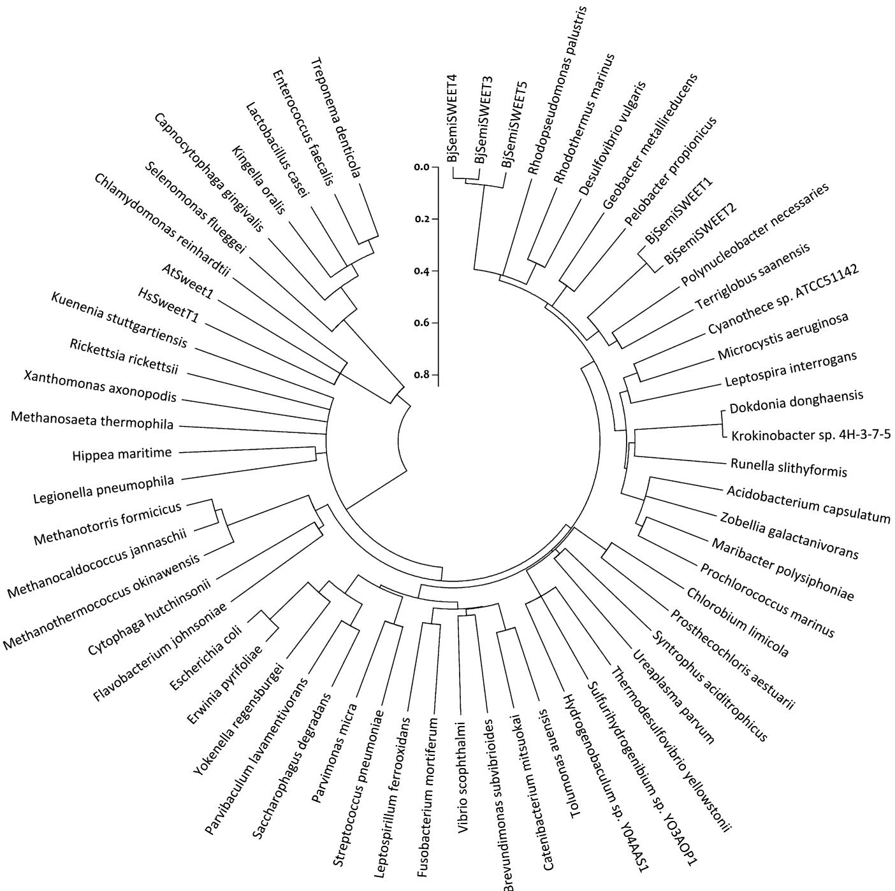  
Fig. 1. A phylogenic (neighbor-joining) tree of 62 PQ-loop proteins from prokaryotes and eukaryotes. The PQ-loop proteins showed here are listed in Table S1. Arabidopsis thaliana (At), Homo sapiens (Hs) and Bradyrhizobium japonicum (Bj). Protein sequences were aligned with ClustalW, and the phylogenic tree was constructed with MEGA5.1.

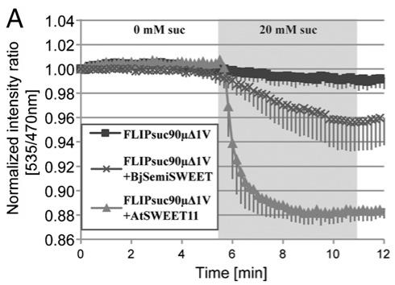

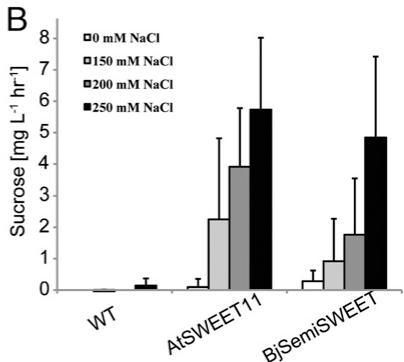  
Fig. 2. A prokaryotic PQ-loop protein functions as a sucrose transporter. (A) The prokaryotic PQ-loop protein, BjSemiSWEET1, and AtSWEET11 from Arabidopsis were coexpressed with the sucrose FRET sensor FLIPsuc90mΔ1V (n ≥ 8) in HEK293T cells. A decrease in biosensor FRET was observed upon addition of sucrose to the culture in AtSWEET11- and BjSemiSWEET1-expressing cells. HEK293T cells transfected with the sensor plasmid only served as a negative control. (B) Sucrose efflux assay from S. elongatus PCC 7942 overexpressing AtSWEET11 and BjSemiSWEET during a 12-h incubation in BG11 media with the indicated NaCl concentration; sucrose was measured from culture supernatants to determine rate of sucrose export (n ≥ 18). Assays were repeated at least three times; error bars indicate SD.

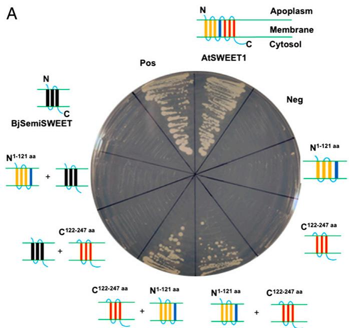

B  
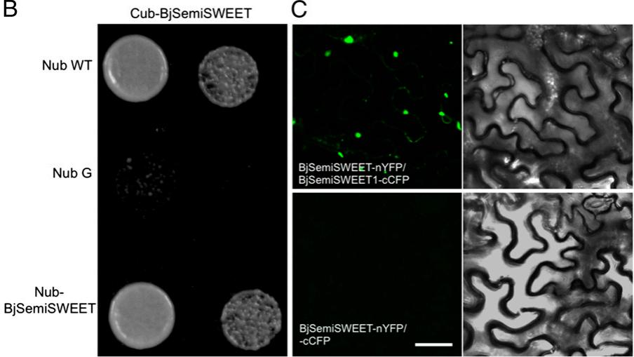  
Fig. 3. Coexpression of AtSWEET1 N and C halves or BjSemiSWEET1 in a yeast hexose transporter mutant EBY4000 and homooligomerization of BjSemiSWEET1. (A) The yeast colonies were first grown on SC (Ura- and Trp-) with 2% maltose and then streaked on SC (Ura- and Trp-) with glucose; they grew for 4 d. $C ^ { 1 2 2 - 2 4 7 \mathrm { \ a a } }$ , half size of AtSWEET1 contained the second MtN3 motif; $\mathsf { N } ^ { 1 - 1 2 1 } \mathsf { a a }$ , half size of AtSWEET1 contained the first MtN3 motif and TM4; Neg, empty vectors pDRf1 plus p112AINE as a negative control; Pos, yeast hexose transporter HXT5 as a positive control. The yellow columns represent TMs 1–3, whereas the red columns represent TMs 5–7 of AtSWEET1. The blue columns represent the fourth TM of AtSWEET1, and 3-TMs of BjSemiSWEET are the black columns. (B) Split ubiquitin assay for homooligomerization of BjSemiSWEET1. Interactions of BjSemiSWEET-Cub fusion with BjSemi-SWEET1-Nub fusion and a WT variant of Nub (NubWT) or mutant variant of Nub (NubG) were tested. Yeast growth assays on an SC medium (-His, -Trp, and –Leu). (C) Split GFP assays for BjSemiSWEET1 homooligomerization. BjSemiSWEET1-nYFP+BjSemiSWEET1-cCFP is shown in Upper, and BjSemiSWEET1-nYFP+cCFP is shown in Lower. Agrobacterium-mediated transient expression of indicated constructs in N. benthamiana leaves. (Left) Reconstitution of YFP-derived fluorescence. (Right) Bright field images. (Scale bar: 20 μm.)

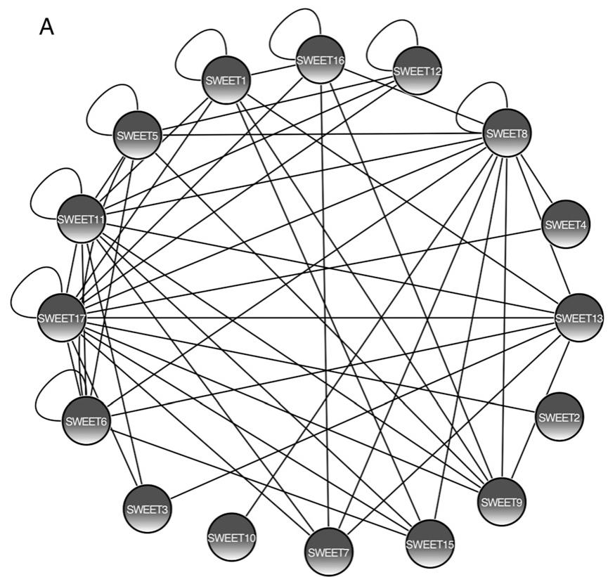

B  
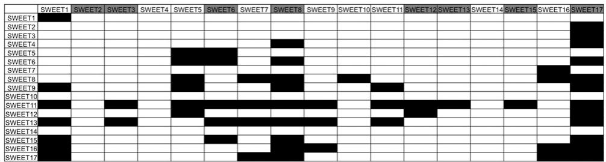  
Fig. 4. AtSWEET interaction network and distribution. (A) Split ubiquitin yeast two-hybrid results of AtSWEET homoand heterooligomerizations were summarized in Cytoscape. (B) The distribution of 8 homomers and 47 heteromers are shown as a matrix. SWEETs listed horizontally and vertically indicate SWEET-Cub and SWEET-Nub fusions, respectively. Black boxes indicate interactions between two SWEETs, and SWEET-Cub fusions show autoactivation marked with gray boxes.  
occur at the plasma membrane except for AtSWEET1, for which interactions were observed in the endoplasmic reticulum (ER) and vesicular compartments (Fig. 5A). The localization in endogenous membrane compartments is consistent with other transient expression analyses performed with an AtSWEET1-YFP fusion in Arabidopsis protoplasts (31) (Fig. S5), but it contrasts with data obtained in stably transformed Arabidopsis transformants (7). It is likely that overexpression of SWEET-GFP fusions in protoplasts or tobacco can lead to mistargeting. Together, our results support the hypothesis that SWEET proteins form homo- or heterooligomeric complexes.

Identification of Key Amino Acids Required for AtSWEET1 Transport Activity. One way of analyzing the necessity of dimerization for function is to test whether nonfunctional forms of the protein can inactivate functional transporters (22, 23). As a first step to testing negative dominance, it was necessary to identify transport-deficient mutants. We rationalized that highly conserved residues may be important for activity. Analysis of alignments of SWEETs selected from different plant species identified highly conserved amino acid residues (Fig. S6). Six positions $( \mathbf { P } ^ { 2 3 } , \mathbf { \breve { P } } ^ { 4 3 }$ $\mathbf { Y } ^ { 5 7 } , \mathbf { G } ^ { 5 8 } , \mathbf { Y } ^ { 1 7 9 }$ , and $\mathbf { G } ^ { 1 8 0 } )$ in three different TM were selected for site-directed mutagenesis (Fig. 6A). Glucose transport activity was tested by expression in the glucose uptake-deficient yeast strain EBY4000 and subsequent monitoring of growth of yeast colonies on media containing glucose as the sole carbon source (32). Four mutations $( \mathrm { P } ^ { 2 3 } \mathrm { T } , \mathrm { \breve { Y } ^ { 5 7 } \mathrm { A } } , \mathrm { G } ^ { 5 8 } \mathrm { D } ,$ and $\mathrm { G } ^ { 1 8 0 } \mathrm { D } )$ abolished glucose transport activity, whereas the other two mutants $( \mathrm { P ^ { 4 3 } T }$ and $\mathbf { Y } ^ { 1 7 9 } \mathbf { A } )$ seemed unaffected (Fig. 6). To exclude that the lack of complementation is caused by a trafficking defect that leads to reduced accumulation of the SWEET protein at the plasma membrane, we localized C-terminal GFP fusions using confocal microscopy in yeast (Fig. 7). We were able to confirm previous reports showing that AtSWEET1-GFP fusions localize to the plasma membrane of yeast and retain glucose transport activity (7) (Fig. S7). GFP fusions of wild type SWEET1 and SWEET1- $\dot { \mathrm { P } } ^ { 2 3 } \dot { \mathrm { T } } , \dot { \mathrm { P } } ^ { 4 3 } \mathrm { T } , \dot { \mathrm { - G } } ^ { 5 8 } \mathrm { D } .$ and $- \mathbf { Y } ^ { 1 7 9 } \mathbf { A }$ were all detectable at the plasma membrane (Fig. 7). By contrast, SWEET1- ${ \bf \cdot } { \bf G } ^ { 1 8 0 } { \bf D }$ -GFP showed significantly reduced plasma membrane localization, whereas SWEET1-Y57A-GFP accumulated predominantly in intracellular compartments. $\mathrm { S W E E T 1 - P ^ { 2 3 } T }$ and $\mathbf { \nabla } _ { - \mathbf { G } } 5 8 _ { \mathrm { D } }$ were characterized by loss transport activity, although plasma membrane localization seemed unaffected, indicating that these mutations led to nonfunctional transporters. Loss of glucose transport activity of SWEET1 $- \Upsilon ^ { 5 7 } \mathbf { A }$ and ${ } _ { - \mathrm { G } ^ { 1 8 0 } \mathrm { D } }$ may be caused either solely by mistargeting of proteins or by both loss of transport/dimerization capacity and targeting defects.

AtSWEET1 Mutants Inhibit Functional SWEETs in a Dominant Negative Fashion. To test whether the nonfunctional SWEET1 mutants interact and inhibit the activity of coexpressed functional transporters, SWEET1 was coexpressed with each of four nonfunctional mutants $( \mathrm { P ^ { 2 3 } T , \ } \mathrm { Y ^ { 5 ^ { 3 } } A , \ G ^ { 5 8 } D } ,$ and $\mathrm { G } ^ { 1 8 0 } \mathrm { D } )$ . Wild type

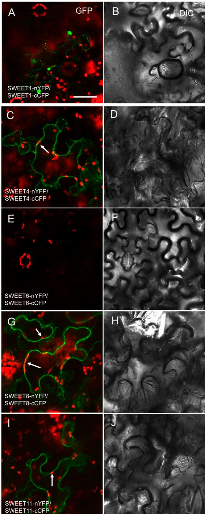  
Fig. 5. Split GFP assays for SWEET homooligomerization. Agrobacteriummediated transient expression of indicated constructs in N. benthamiana leaves. Reconstitution of YFP-derived fluorescence and bright field images are shown in Left and Right, respectively. Chlorophyll autofluorescence is marked with red, and the white arrows indicate attachment of chloroplast to the plasmolyzed plasma membrane. SWEET4, -8, and -11 YFP samples were plasmolyzed in 4% NaCl. (Scale bars: 20 μm.) Reconstitution of YFP

SWEET1 was expressed from the strong ADH promoter, whereas the mutants were expressed from the strong PMA1 promoter (fragment). Analysis of yeast colony growth on the media with glucose as the sole carbon source showed that $\mathrm { S W E E T 1 - P ^ { 2 3 } T }$ and ${ } ^ { - } \mathrm { G } ^ { 1 8 0 } \mathrm { D }$ led to slightly reduced glucose transport activity, whereas $\mathbf { S W E E T 1 - Y ^ { 5 7 } } \mathbf { \breve { A } }$ and $\boldsymbol { - G } ^ { 5 8 } \mathbf { D }$ dramatically inhibited wild type SWEET1 activity (Fig. 8). Based on the localization of the mutants, we can differentiate two types of negative dominance; coexpression of $\mathbf { S W E E T 1 - Y } ^ { 5 7 } \mathbf { A }$ with a functional SWEET results in the complete loss of SWEET1 activity, perhaps caused by oligomerization within the trafficking pathway, leading to retention of the transporter and supporting notion that SWEET1 forms functional homooligomers (Figs. 7I and 8). Importantly, $\mathrm { S W E E T 1 - G ^ { 5 8 } D }$ , which seemed unaffected with respect to plasma membrane targeting, also inhibited SWEET1 activity when coexpressed with wild type transporter (Figs. 7K and 8). Taken together, these results strongly suggest that SWEET monomers are not capable of forming sugar-translocating pores on their own but require oligomerization for transport activity.

## Discussion

SWEETs are an important superfamily of sugar transporters with critical roles in plants, animals (4, 7, 13), and potentially, a variety of microorganisms. SWEETs differ in both primary sequence and predicted structure from two other classes of sugar transporters, the MFS family members [including Lac permease, GLUT glucose transporters (SLC2), STPs proton glucose cotransporters, and SUT sucrose proton cotransporters] and from the the sodium-dependent glucose transporters (SLC5). All eukaryotic SWEETs identified to date are composed of a direct repeat of a 3-TM that is separated by TM4. Because of the low sequence conservation of TM4, it most likely serves as a domain inversion linker (Fig. S6) (7, 33). Here, we identified prokaryotic homologs, which all contain only a single 3-TM, and show that BjSemiSWEET1 from Bradyrhizobium mediates import and efflux of sucrose, similar to clade III plant SWEETs. This finding suggests that eukaryotic SWEETs in plants and humans have evolved from a 3-TM unit by tandem duplication and fusion with insertion of TM4. If one assumes that SemiSWEETs and SWEETs insert preferentially into the membrane in a configuration in which the N terminus points to the outside, the additional fourth TM in SWEETs helps reorient the second repeat unit into the same orientation as in an SemiSWEET dimer. In contrast to SemiSWEETs, which have to form homooligomers to create a functional pore, the individual halves of SWEET1 do not seem to be able to assemble into a functional homodimer by themselves. However, when expressed separately, the two halves assemble into a functional glucose transporter. Moreover, SWEETs most likely have to form at least dimers (SemiSWEETs tetramers) to allow for creation of a functional pore. This hypothesis is supported by the finding that SWEETs can homo- and heterooligomerize and the demonstration that nonfunctional SWEETs can block the activity of functional SWEETs when coexpressed. Together, our data suggest that SWEETs evolved by duplication and fusion of an SemiSWEET 3-TM unit, and most likely, the pore is formed by a SWEET dimer (SemiSWEET tetramer), creating a core structure of 12-TM with two linker TMs (TM4). Functional SWEETs, thus, seem to be similar in size to MFS transporters but different in that SWEETs may be built from parallel 3-TM units (N terminus always outside), whereas MFS transporters have an antiparallel organization of their four 3-TM units (Fig. 9) (34). Our data do not exclude the possibility that, like the MFS transporter GLUT1, the 12-TM units create the pore but can assemble into multibarreled oligomers (35).

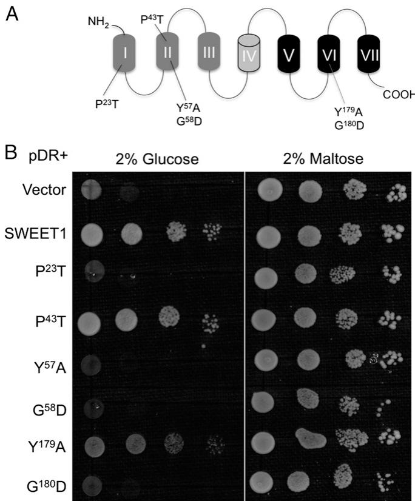  
Fig. 6. Functional analysis of mutant AtSWEET1 proteins by complementation of yeast hexose transport defective strain EBY4000: (A) 7-TM with duplication of the first and last three TMs and six mutation sites in three different TM are shown, and (B) growth assays of mutant AtSWEET1 proteins expressed in EBY4000 yeast strain were performed on YNB media containing 2% glucose or maltose. Except for SWEET1 mutants carrying $\mathsf { P } ^ { 4 3 } \mathsf { T }$ and $\mathsf { Y } ^ { 1 7 9 } \mathsf { A } ,$ other mutations $( { \mathsf { P } } ^ { 2 3 } \mathsf { T } , \mathsf { Y } ^ { 5 7 } { \mathsf { A } } , { \mathsf { G } } ^ { 5 8 } { \mathsf { D } } _ { i }$ , and $\mathsf { G } ^ { 1 8 0 } \mathsf { D } )$ in SWEET1 lead to loss of glucose transport activity. Empty (pDRf1) vector and AtSWEET1 were used as the negative and positive controls, respectively. Yeast cells were grown at $3 0 ~ ^ { \circ } \mathsf { C }$ for 4 d.

B. japonicum BjSemiSWEET1 Mediates Sucrose Transport. SWEETs were reported as a unique class of heptahelical sugar transporters belonging to the MtN3/saliva family members (4, 7, 33). Database searches helped identify over 90 putative PQ-loop proteins from different prokaryotes. In contrast to the eukaryotic SWEETs, all analyzed members from prokaryotes harbor only 3-TM. Among eight SemiSWEETs tested, the B. japonicum BjSemiSWEET1 mediated sucrose transport when expressed in HEK293T cells (Fig. 2). Whether sucrose is the native substrate or whether the other homologs also transport sucrose but are not targeted efficiently enough to the plasma membrane of HEK293T cells remains to be tested. BjSemiSWEET1 belongs to a PQ-loop protein family with 3-TM structure from prokaryotes, which has sugar transport activity. Previously, two UPF0041 family members with 3-TM had been identified as mitochondrial pyruvate transporters (18, 19), and the PQ-loop proteins PQLC2 and YPQs were shown to mediate transport of cationic amino acids (15). Together, the MtN3-like clan seems to consist of transporters for sugars, organic acids, and amino acids.

SemiSWEETs are widespread and found in archaea and eubacteria; however, they occur only in a limited number of species. They are essentially absent from fungi, where we only found one member in an oomycete, the plant pathogen Phytophthora. Interestingly, SemiSWEETs are present in a couple of bacteria that are associated with plants (e.g., Bradyrhizobium and Erwinia). The analysis of semisweet mutants is expected to provide insights into the role of these transporters in bacteria and Phytophthora. The search for proteins associated with Semi-SWEETs in operons did not reveal conserve associations that might be used as a general hint regarding the physiological function. The most striking association is with a putative 6-phosphoβ-glucosidase as part of a phosphotransferase sugar transport operon in Streptococcus species. One may, thus, speculate that these SemiSWEETs mediate efflux of a reaction product of the glucosidase, but additional analyses are required to test this hypothesis.

SWEETs Can Be Reconstituted by Coexpression of a Split Transporter. Eukaryotic SWEETs are composed of two SemiSWEET units. Thus, the question arose whether a single unit of SWEETs would be sufficient for reconstituting a functional pore or whether the two units have evolved to be interdependent. Coexpression of split transporters can lead to reconstitution of transport activity; examples include Lac permease and the SUT sucrose transporter (36–38). However, none of the truncated Arabidopsis SWEET1 polypeptides containing the first or second half (each containing a 3-TM motif) reconstitute a functional transporter. By contrast, coexpression of the two halves of a split SWEET1 successfully reconstituted glucose transport activity.

Arabidopsis SWEETs Form Homo- or Heterooligomers in Yeast and Plants. Among various transporters, the Arabidopsis SUT sucrose transporter and AMT ammonium transporters assemble as homo- or heterooligomers (22, 23, 38, 39), whereas the human GLUTs form tetramers (35). By contrast, other characterized sugar transporters, such as Lac permease, seem to function as monomers (24). An intriguing question was, therefore, whether a single 7-TM SWEET protein is sufficient for transport activity. Oligomerization of transporters, such as SUTs, AMT1, and KAT1, has successfully been identified by the split ubiquitin system (21, 23, 38–40). Here, the split ubiquitin system was used to systematically identify interactions between AtSWEET proteins. Among 289 combinations of 17 SWEET proteins tested, 55 interactions were identified. Interaction pairs identified in the Y2H screen were verified by using split GFP assays in tobacco leaves. The high degree of consistency of the results from both the yeast two-hybrid and split GFP assays suggests that oligomerization is prevalent among Arabidopsis SWEETs. The split GFP assays showed that the interactions localize at the plasma membrane, except for the SWEET1 homooligomer. The in vivo interaction data imply that the functional unit of AtSWEET1 is likely to be at least a dimer. In analogy, SemiSWEETs would be predicted to form a pore from a tetramer.

Functionally Important Residues of SWEET1. Alignments showed a series of highly conserved residues in the first and second halves of the SWEETs. Prolines are recognized as important residues in transporters that could be important in creating specific shapes of TM by introducing kinks; they can play important roles for the transport cycle by allowing for dynamic processes, and also, they can interrupt the hydrogen bonding network of α-helical TM (41). Among the six residues tested, two mutations $( \mathrm { P ^ { 4 3 } T }$ and $\mathrm { Y } ^ { 1 7 9 } \mathrm { A } )$ did not reduce glucose transport activity of AtSWEET1 in yeast significantly. All of the other four mutations $( \mathrm { P } ^ { 2 3 } \mathrm { T } , \mathrm { Y } ^ { 5 7 } \mathrm { A } , \dot { \mathrm { G } } ^ { 5 8 } \mathrm { D } ,$ and $\mathrm { G } ^ { 1 8 0 } \mathrm { D } { \dot { ) } }$ led to a loss of transport. Localization of GFP fusions showed that $\mathrm { P } ^ { 2 3 } \mathrm { T }$ and $\mathrm { G } ^ { 5 8 } \mathrm { D }$ mutants did not have a major effect on plasma membrane targeting, whereas $\mathbf { Y } ^ { 5 7 } \mathbf { A }$ and $\mathrm { G } ^ { 1 8 0 } \mathrm { D }$ mutants inhibited plasma membrane targeting (Fig. 7). Therefore, lack of transport activity of $\mathbf { Y } ^ { 5 7 } \mathbf { A }$ and $\breve { \mathrm { G } } ^ { 1 8 0 } \breve { \mathrm { D } }$ mutants in yeast was likely caused by mistargeting of AtSWEET1, whereas $\check { \mathrm { P } } ^ { 2 3 } \mathrm { T }$ and $\mathrm { G } ^ { 5 8 } \dot { \mathrm { D } }$ proteins lose their function, although they localized at the plasma membrane. In the absence of structural information and without with wild type AtSWEET1 in planta. We observed that the mutated AtSWEET1 forms can inhibit the activity of a coexpressed functional SWEET when tested in yeast for glucose uptake. Our data provide evidence for oligomerization but do not allow us to determine whether they form dimers or higher-order oligomers. In summary, SemiSWEETs, a SWEET homolog from prokaryotes, can function as a sucrose transporter, which is composed of 3-TM. We also show that plant SWEETs oligomerize and that oligomerization seems to be necessary for activity.

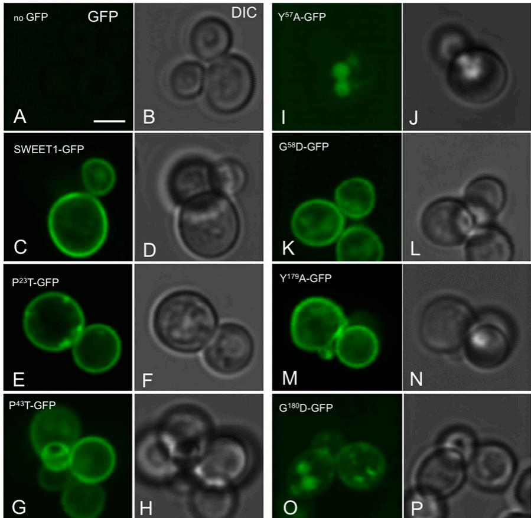  
more extensive mutagenesis, our data do not provide detailed insights into the functional role of these residues.

Direct Evidence for the Importance of SWEET Oligomerization for Transport Function. All combinations of WT and mutated proteins $( \mathrm { Y } ^ { 5 7 } \mathrm { A } + \mathrm { S W E E T 1 }$ $\mathrm { G } ^ { 5 8 } \mathrm { D }$ +SWEET1, and $\mathbf { G } ^ { 1 8 0 } \mathbf { D } \mathbf { + } \mathbf { S } \mathbf { W } \mathbf { E } \mathbf { \dot { E } } \mathbf { T } 1$ respectively) interacted inplanta as indicated by reassembly ofsplit GFP, indicating that the mutated proteins were able to associate  
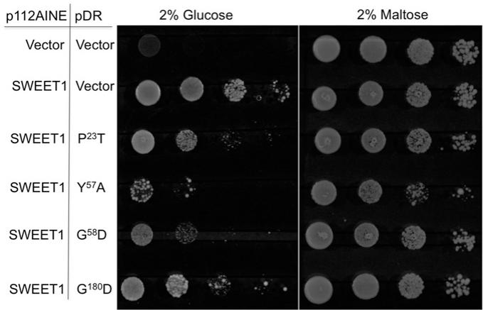  
Fig. 8. Inhibition of glucose transport by coexpressing WT and mutant AtSWEET1 proteins in yeast EBY4000. p112AINE empty or p112AINE-SWEET1 vector was cotransformed with pDRf1 empty or pDR-mSWEET1 $( \mathsf { P } ^ { 2 3 } \mathsf { T } , \mathsf { Y } ^ { 5 7 } \mathsf { A } ,$ ${ \mathsf { G } } ^ { 5 8 } { \mathsf { D } } ,$ , and $\mathsf { G } ^ { 1 8 0 } \mathsf { D } )$ vector into yeast strain EBY4000. Growth assays of yeast cells coexpressing WT and mutant AtSWEET1 proteins were performed in YNB media containing 2% glucose or maltose. Coexpression of mutant SWEET1 proteins together with WT inhibited SWEET1 glucose transport activity at different levels, and mutations at either $\mathsf { Y } ^ { 5 7 }$ or $\mathsf { G } ^ { 5 8 }$ showed severe effects.  
Fig. 7. Localization of WT and mutant AtSWEET1 proteins in yeast. WT and mutant AtSWEET1-GFP fusion proteins were expressed in the EBY4000 yeast strain. After growth on minimal medium with maltose as the sole carbon source, cells were analyzed by confocal microscopy (SP5). (Left) GFP fluorescence and (Right) bright field images from the following constructs are shown: (A and B) empty vector without GFP expressions, (Cand D) AtSWEET1-GFP, (E and $F ) { \mathsf { P } } ^ { 2 3 }$ T-GFP, (G and H) P43T-GFP, (I and J) $\mathsf { Y } ^ { 5 7 } \mathsf { A } \mathsf { - G F P } ,$ , (K and L) $\mathsf { Y } ^ { 5 8 } \mathsf { D }$ -GFP, (M and N) $\mathsf { Y } ^ { 1 7 9 } \mathsf { A }$ -GFP, and (O and P) $\mathsf { G } ^ { 1 8 0 } \mathsf { D } .$ -GFP. (Scale bar: 10 μm.)

Taking the relative small size of 3-TM SemiSWEET or 7-TM SWEET proteins into consideration and in analogy to other sugar transporters that contain 12- to 14-TM, it seems reasonable to assume that the minimal structure that forms a functional pore is either a tetramer of SemiSWEETs or a dimer of SWEETs. Structural information from crystals or NMR analyses will be critical for determining the structure function relationship of the SemiSWEET and SWEET sugar transporters as well as the other PQ-loop transporters.

## Materials and Methods

Candidate Sequence Search and Phylogenic Analyses. The MtN3/saliva (PF03083) motif found in eukaryotic SWEETs was used for similarity searches in National Center for Biotechnology Information, European Molecular Biology Laboratory, and DNA Data Base in Japan databases. Retrieved sequences were first verified by alignment with Clustal Omega (http://www.ebi.ac.uk/Tools/msa/ clustalo/) and subsequently analyzed with Weblogo3.3 (http://weblogo. threeplusone.com/create.cgi). The phylogenic relationship was inferred using neighbor joining (42). The optimal tree with the sum of branch length = 24.05 is shown (Fig. 1). The tree is drawn to scale, with branch lengths in the same units as the evolutionary distances of species used to infer the phylogenetic tree. Evolutionary distances were computed using the Poisson correction method (43) and are in the units of the number of amino acid substitutions per site. The analysis involved 62 amino acid sequences. All positions containing gaps and missing data were eliminated. There was a total of 60 positions in the final dataset. Evolutionary analyses were conducted in MEGA5 (44).

SemiSWEET-tetramer

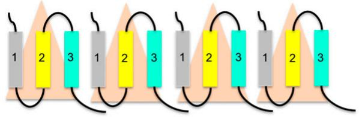  
SWEET-dimer

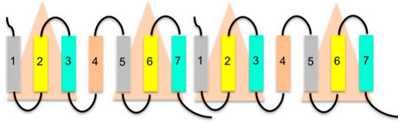  
Lac Permease-monomer

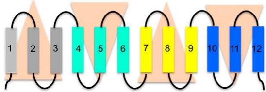  
Fig. 9. Schematic representation of hypothesized SWEET and SemiSWEET oligomers. Colored boxes indicate TMs, and loops are marked with lines. Numbers in the boxes indicate the order of each TM, and triangles represent functional 3-TM units. Tetramer of SemiSWEET and dimer of SWEET all consist of four 3-TM units, suggesting that 12 helices in consecutive order make functional pores for sugar transport similar as in the 12-TM lactose permease.

Cloning of a Prokaryotic PQ-Loop Gene. The ORF of the single PQ-loop–containing gene from B. japonicum USDA 110 was amplified and cloned into a Gateway Entry Vector pDONR221f1 (Invitrogen) by BP (recombination of attB sites with attP sites) reaction as described (45). Primers used amplification of the gene are as follows: 5′-GGGGACAAGTTTGTACAAAAAAGC-AGGCTTCACCATGGACCCGTTCTTGATCAAG-3′; 5′-GGGGACCACTTTGTACAA-GAAAGCTGGGTCGGATCCGCCGTATCTCAGCTTCATCAC-3′. After sequence confirmation, the ORF was transferred into the destination vectors pDRf1- GW and pcDNA3.2/V5-DEST (Invitrogen) by LR (recombination of attL sites with attR sites) reactions.

FRET Sucrose Sensor Analyses of Prokaryotic PQ-Loop Proteins in HEK293T Cells. Analyses for sucrose uptake activity into human cells were performed using an FRET sucrose sensor as described (4, 46). HEK293T cells were cotransfected with plasmids containing the sucrose sensor FLIPsuc90μΔ1V (1 μg) and the candidate gene BjSemiSWEET1 (1 μg) in six-well plates using Lipofectamine 2000 (Invitrogen). FRET imaging and analyses were performed as described (46). The sucrose transporter AtSWEET11 (plus the sucrose sensor FLIPsuc90μΔ1V) and the sucrose sensor alone were used as positive and negative controls, respectively.

Coexpression of Different SWEET1 Domains in the Yeast Hexose Transport Mutant EBY4000. Transmembrane spanning domains of AtSWEET1 were predicted by TMHMM (http://www.cbs.dtu.dk/services/TMHMM/; Aramemnon). The two MtN3/saliva motifs of AtSWEET1 were amplified using the primer pairs AtF1-GGGGACAAGTTTGTACAAAAAAGCAGGCTTCACCATGAACATCGCT-CACACTATC; AtR1-GGGGACCACTTTGTACAAGAAAGCTGGGTCGGATCCTTAA-AGAGCAAAGAGAGAGACAGA for the N-proximal half-size protein and AtF2- GGGGACAAGTTTGTACAAAAAAGCAGGCTTCACCATGCAAGGAAACGGTAGAA AACTC; AtR2-GGGGACCACTTTGTACAAGAAAGCTGGGTCGGATCCTTAAACT TGAAGGTCTTGCTTTCC for the C-proximal half-size protein. For mutation of conserved residues in AtSWEET1 by PCR, the following primers were used: mP23 F-CTTGGCTACTTCGATAAC, mP23 R-GTTATCGAAGTAGCCAAG; mP43 F-TGGTATCACTTATCCAAT, mP43 R-ATTGGATAAGTGATACCA; mY57 F-CTCTGCTTGGGCTGGACT, mY57 R-AGTCCAGCCCAAGCAGAG; mG58 F-GGTA-TGATCTTCCCTTTG, mG58 R-CAAAGGGAAGATCATACC; mY179 F-GTGGTTC GTCGCTGGTCT, mY179 R-AGACCAGCGACGAACCAC; and mG180 F-GTCT-

ATGATCTAATCGGT, mG180 R-ACCGATTAGATCATAGAC. Target PCR fragments were purified and cloned into the Gateway entry vector pDONR221f1 as described above. Entry clone plasmids were mixed with destination vectors pDRf1-GW or/and p112AINE-GW for constructs expressing in yeast by LR reactions. Coexpressions of different combinations of half-size AtSWEET1 versions (each containing an MtN3/saliva motif) or WT and mutant AtSWEET1 were performed by cotransformation of the yeast hexose transporter mutant EBY4000 [hxt1-17D::loxP gal2D::loxP stl1D::loxP agt1D::loxP ydl247wD::loxP yjr160cD::loxP] with pDRf1-GW– and p112AINE-GW–based plasmids through LiCl transformation. The yeast hexose transporter HXT5 was used as a positive control, and empty vectors pDRf1 plus p112AINE were introduced as a negative control. To exclude artifacts caused by differences in the vector/promoter on introduced SWEET expression, each combination of two MtN3/saliva motifs containing half-sized proteins was repeated by exchanging the respective host vectors. Transformants were first grown on selective synthetic complete (SC) (-Ura and -Trp) medium containing 2% (vol/vol) maltose (Sigma) as the sole carbon source, and subsequently, they were streaked on solid SC (-Ura and -Trp) media supplemented with 2% glucose (Sigma) as the sole carbon source and incubated at 30 °C for 4 d. Growth was recordedby scanning the plates on a flatbed scanner.

Synechococcus Growth Conditions. S. elongatus PCC 7942 was grown in temperature-controlled $( 3 2 ^ { \circ } \mathsf { C } )$ and CO -controlled (2%) Multitron Infors HT Incubators with CO and photosynthetic lighting options (ATR) installed with fluorescent bulbs (15 W Gro-Lux; Sylvania) and constant illumination at the growth surface of ∼100 μE $\mathsf { m } ^ { 2 } \mathsf { s } ^ { - 1 }$ . Flasks were shaken at 100 rpm. Cultures were grown in BG11 media buffered with 1 g/L Hepes (pH 8.3; Sigma) to improve consistency during culture dilutions (this step was not necessary for sucrose export). Construction of strains overexpressing SemiSWEETs and SWEETs was obtained through traditional cloning using isothermal assembly methods (47) into Neutral Site 3 vector (48) and transformed into S. elongatus 7924 as previously described (26, 49). Genomic integration of target constructs was selected on BG11 plates with 12.5 μg/mL chloramphenicol and verified through colony PCR and sequencing.

Cyanobacterial Sucrose Secretion Assays. WT-, SWEET-, and SemiSWEETbearing cyanobacteria were grown as described above and diluted daily to maintain cultures in log phase (OD750 between 0.3 and 1.5). To assay sucrose secretion, 50 mL cyanobacterial cultures were pelleted for 15 min at ∼1,500 × g (Sorvall Legend), washed one time, pelleted, and resuspended in fresh BG11 (7+ mL) with 1 mM IPTG (isopropyl β-D-1-thiogalactopyranoside) and the indicated concentration of NaCl. Cell density in concentrated cultures was determined through measurement of $\mathtt { O D 7 5 0 }$ (Spectramax Plus; Molecular Devices), and cultures were diluted to a uniform density OD750 at 2.5. Induced cyanobacteria were grown in 0.5- to 1-mL cultures in a 24-well plate format in the incubator with illumination as described above for 12 h of continuous light. Cyanobacterial cells were then pelleted, and sucrose secretion rates were determined from the culture supernatant using Sucrose/ D-Glucose Assay Kits (Megazyme).

Mating-Based Split Ubiquitin System. For mating-based split ubiquitin assays, all 17 AtSWEET ORFs and BjSemiSWEET were cloned into the mating-based split ubiquitin Nub vectors pXN22\_GW and pXN25\_GW and Cub vector pMETYC\_GW. Assays were performed as described (29).

Split GFP Assay. nYFP and cCFP sequences were fused to the C-terminal sequences of five AtSWEETs and BjSemiSWEET in PXNGW and PXCGW vectors, respectively (30). The fusion proteins were introduced into N. benthamiana leaves by using the Agrobacterium-mediated transient expression method (30). Interactions of the coexpressed proteins were monitored by detection of YFP fluorescence under a confocal microscope (SP5; Leica). All constructs were verified by DNA sequencing. All assays were repeated independently at least three times with comparable results.

Localization of AtSWEETs in Yeast and Plants. WT and mutant AtSWEET1 ORFs were cloned into the pDRf1-GFP GW vector (7). The EBY4000 yeast strain was transformed, and three independent colonies from each transformant were cultured in yeast nitrogen base (YNB) media containing 2% maltose. For transient expression of AtSWEET1-GFP and AtSWEET11-GFP fusion proteins, AtSWEET1 and AtSWEET11 ORFs were cloned into pABindGFP destination plasmid (50) followed by transient expression in N. benthamiana leaves using the Agrobacterium-mediated transient expression method (30). GFP fluorescence was detected under a confocal microscope (SP5; Leica).

ACKNOWLEDGMENTS. We thank G. Grossmann and H. Cartwright for advice and help with confocal imaging and E. Smith-Valle for technical assistance

1. Walmsley AR, Barrett MP, Bringaud F, Gould GW (1998) Sugar transporters from bacteria, parasites and mammals: Structure-activity relationships. Trends Biochem Sc 23(12):476–481.

2. Rogers K (2011) Bacteria and Viruses (Britannica Educational Publishing, New York).

3. Lalonde S, Wipf D, Frommer WB (2004) Transport mechanisms for organic forms of carbon and nitrogen between source and sink. Annu Rev Plant Biol 55:341–372.

4. Chen LQ, et al. (2012) Sucrose efflux mediated by SWEET proteins as a key step for phloem transport. Science 335(6065):207–211.

5. Abramson J, et al. (2003) Structure and mechanism of the lactose permease of Escherichia coli. Science 301(5633):610–615.

6. Scheepers A, Joost HG, Schürmann A (2004) The glucose transporter families SGLT and GLUT: Molecular basis of normal and aberrant function. JPEN J Parenter Enteral Nutr 28(5):364–371.

7. Chen LQ, et al. (2010) Sugar transporters for intercellular exchange and nutrition of pathogens. Nature 468(7323):527–532.

8. Guan YF, et al. (2008) RUPTURED POLLEN GRAIN1, a member of the MtN3/saliva gene family, is crucial for exine pattern formation and cell integrity of microspores in Arabidopsis. Plant Physiol 147(2):852–863.

9. Baker RF, Leach KA, Braun DM (2012) SWEET as sugar: New sucrose effluxers in plants. Mol Plant 5(4):766–768.

10. Chardon F, et al. (2013) Leaf fructose content is controlled by the vacuolar transporter SWEET17 in Arabidopsis. Curr Biol 23(8):697–702.

11. Yang B, Sugio A, White FF (2006) Os8N3 is a host disease-susceptibility gene for bacterial blight of rice. Proc Natl Acad Sci USA 103(27):10503–10508.

12. Antony G, et al. (2010) Rice xa13 recessive resistance to bacterial blight is defeated by induction of the disease susceptibility gene Os-11N3. Plant Cell 22(11):3864–3876.

13. Yuan M, Chu Z, Li X, Xu C, Wang S (2010) The bacterial pathogen Xanthomonas oryzae overcomes rice defenses by regulating host copper redistribution. Plant Cell 22(9):3164–3176.

14. Artero RD, et al. (1998) saliva, a new Drosophila gene expressed in the embryonic salivary glands with homologues in plants and vertebrates. Mech Dev 75(1-2): 159–162.

15. Jézégou A, et al. (2012) Heptahelical protein PQLC2 is a lysosomal cationic amino acid exporter underlying the action of cysteamine in cystinosis therapy. Proc Natl Acad Sci USA 109(50):E3434–E3443.

16. Saudek V (2012) Cystinosin, MPDU1, SWEETs and KDELR belong to a well-defined protein family with putative function of cargo receptors involved in vesicle trafficking. PLoS One 7(2):e30876.

17. Pattison RJ (2008) Characterization of the PQ-loop repeat membrane protein family in Arabidopsis thaliana. PhD thesis (University of Glasgow, Glasgow, Scotland).

18. Bricker DK, et al. (2012) A mitochondrial pyruvate carrier required for pyruvate uptake in yeast, Drosophila, and humans. Science 337(6090):96–100.

19. Herzig S, et al. (2012) Identification and functional expression of the mitochondrial pyruvate carrier. Science 337(6090):93–96.

20. Gomes D, et al. (2009) Aquaporins are multifunctional water and solute transporters highly divergent in living organisms. Biochim Biophys Acta 1788(6):1213–1228.

21. Ludewig U, et al. (2003) Homo- and hetero-oligomerization of ammonium transporter-1 NH4 uniporters. J Biol Chem 278(46):45603–45610.

22. Loqué D, Lalonde S, Looger LL, von Wirén N, Frommer WB (2007) A cytosolic transactivation domain essential for ammonium uptake. Nature 446(7132):195–198.

23. Yuan L, et al. (2013) Allosteric regulation of transport activity by heterotrimerization of Arabidopsis ammonium transporter complexes in vivo. Plant Cell 25(3):974–984.

24. Sahin-Tóth M, Lawrence MC, Kaback HR (1994) Properties of permease dimer, a fusion protein containing two lactose permease molecules from Escherichia coli. Proc Natl Acad Sci USA 91(12):5421–5425.

25. Klähn S, Hagemann M (2011) Compatible solute biosynthesis in cyanobacteria. Environ Microbiol 13(3):551–562.

26. Ducat DC, Avelar-Rivas JA, Way JC, Silver PA (2012) Rerouting carbon flux to enhance photosynthetic productivity. Appl Environ Microbiol 78(8):2660–2668.

27. Xu Y, et al. (2013) Altered carbohydrate metabolism in glycogen synthase mutants of Synechococcus sp. strain PCC 7002: Cell factories for soluble sugars. Metab Eng 16: 56–67.

28. Du W, Liang F, Duan Y, Tan X, Lu X (2013) Exploring the photosynthetic production capacity of sucrose by cyanobacteria. Metab Eng 19C(2013):17–25.

29. Lalonde S, et al. (2010) A membrane protein/signaling protein interaction network for Arabidopsis version AMPv2. Front Physiol 1:24.

30. Kim JG, et al. (2009) Xanthomonas T3S Effector XopN Suppresses PAMP-Triggered Immunity and Interacts with a Tomato Atypical Receptor-Like Kinase and TFT1. Plant Cell 21(4):1305–1323.

31. Wolfenstetter S, Wirsching P, Dotzauer D, Schneider S, Sauer N (2012) Routes to the tonoplast: The sorting of tonoplast transporters in Arabidopsis mesophyll protoplasts. Plant Cell 24(1):215–232.

32. Wieczorke R, et al. (1999) Concurrent knock-out of at least 20 transporter genes is required to block uptake of hexoses in Saccharomyces cerevisiae. FEBS Lett 464(3): 123–128.

33. Sosso D, Chen LQ, Frommer WB (2013) The SWEET glucoside transporter family. Encyclopedia of Biophysics, ed Roberts G (Springer, Berlin), pp 2556–2558.

34. Madej MG, Dang S, Yan N, Kaback HR (2013) Evolutionary mix-and-match with MFS transporters. Proc Natl Acad Sci USA 110(15):5870–5874.

35. De Zutter JK, Levine KB, Deng D, Carruthers A (2013) Sequence determinants of GLUT1 oligomerization—analysis by homology-scanning mutagenesis. J Biol Chem 288(28):20734–20744.

36. Stochaj U, et al. (1988) Truncated forms of Escherichia coli lactose permease: Models for study of biosynthesis and membrane insertion. J Bacteriol 170(6):2639–2645.

37. Gao M, Loe DW, Grant CE, Cole SP, Deeley RG (1996) Reconstitution of ATPdependent leukotriene C4 transport by co-expression of both half-molecules of human multidrug resistance protein in insect cells. J Biol Chem 271(44):27782–27787.

38. Reinders A, et al. (2002) Protein-protein interactions between sucrose transporters of different affinities colocalized in the same enucleate sieve element. Plant Cell 14(7): 1567–1577.

39. Schulze WX, Reinders A, Ward J, Lalonde S, Frommer WB (2003) Interactions between co-expressed Arabidopsis sucrose transporters in the split-ubiquitin system. BMC Biochem 4(1):3.

40. Obrdlik P, et al. (2004) K+ channel interactions detected by a genetic system optimized for systematic studies of membrane protein interactions. Proc Natl Acad Sci USA 101(33):12242–12247.

41. Deber CM, Therien AG (2002) Putting the beta-breaks on membrane protein misfolding. Nat Struct Biol 9(5):318–319.

42. Saitou N, Nei M (1987) The neighbor-joining method: A new method for reconstructing phylogenetic trees. Mol Biol Evol 4(4):406–425.

43. Zuckerkandl E, Pauling L (1965) Evolutionary Divergence and Convergence in Proteins (Academic, London), pp 97–166.

44. Tamura K, et al. (2011) MEGA5: Molecular evolutionary genetics analysis using maximum likelihood, evolutionary distance, and maximum parsimony methods. Mol Biol Evol 28(10):2731–2739.

45. Ausubel FM, et al. (1994) Current Protocols in Molecular Biology (Green Publishing Associates and Wiley, New York).

46. Hou BH, et al. (2011) Optical sensors for monitoring dynamic changes of intracellular metabolite levels in mammalian cells. Nat Protoc 6(11):1818–1833.

47. Gibson DG, et al. (2009) Enzymatic assembly of DNA molecules up to several hundred kilobases. Nat Methods 6(5):343–345.

48. Niederholtmeyer H, Wolfstädter BT, Savage DF, Silver PA, Way JC (2010) Engineering cyanobacteria to synthesize and export hydrophilic products. Appl Environ Microbiol 76(11):3462–3466.

49. Clerico EM, Ditty JL, Golden SS (2007) Specialized techniques for site-directed mutagenesis in cyanobacteria. Methods Mol Biol 362:155–171.

50. Bleckmann A, Weidtkamp-Peters S, Seidel CA, Simon R (2010) Stem cell signaling in Arabidopsis requires CRN to localize CLV2 to the plasma membrane. Plant Physiol 152(1):166–176.