# Genome-wide identification of the auxin transporter gene families in sweet potato (Ipomoea batatas) and their expression during tuberization

Sarah R. Mathura (  sarah.mathura@my.uwi.edu )

University of the West Indies

Fedora Sutton ScienceVisions Inc

Valerie Bowrin

University of the West Indies

## Research Article

Keywords: ABCB, AUX/LAX, Ipomoea batatas, PILS, PIN

Posted Date: March 1st, 2023

DOI: https://doi.org/10.21203/rs.3.rs-2616315/v1

License: @ This work is licensed under a Creative Commons Attribution 4.0 International License. Read Full License

Additional Declarations: No competing interests reported.

Version of Record: A version of this preprint was published at Tropical Plant Biology on June 21st, 2023. See the published version at https://doi.org/10.1007/s12042-023-09333-1.

## Abstract

Auxin is a plant phytohormone that is essential for the initiation of tuberization in sweet potato (Ipomoea batatas (L.) Lam.). Auxin exerts these effects via polar auxin transport facilitated by various auxin influx and efflux carriers. It is unclear which members of the auxin transporter families: PIN, PILS, AUX/LAX, and ABCB, are involved in sweet potato tuber initiation and development. Therefore, a genome-wide analysis of the I batatas auxin transporter genes was conducted, and their expression patterns during storage root initiation and development were analyzed. Five IbLAX, 16 IbPIN, 12 IbPILS, and 34 IbABCB family members were identified. These genes showed high conservation among families based on their intron-exon structure, motif composition, and phylogenetic analysis. Additionally, the promoter regions of these genes had various cis-acting regulatory elements involved in hormone, light, and developmental responses. The auxin transporter genes were expressed in various sweet potato tissues, and many were differentially expressed during storage root development. IbLAX1, IbPIN13, IbPILS7, IbABCB1, and IbABCB14showed up-regulated expression during tuber initiation. This study characterizes these auxin transporter gene families for the first time. These results are an important reference for validation studies to determine the specific functions of these genes and their auxin transporting capability.

## Introduction

Sweet potato (Ipomoea batatas (L.) Lam.) is an important food crop that is cultivated primarily for its edible storage roots. Its high nutritional content and adaptability to growing in numerous environmental conditions make it an important food source for people especially in developing countries. Consequently, research has been conducted to understand the mechanism by which the tuberizing storage roots develop from non-tuberizing fibrous roots, aiming to improve crop yield. This mechanism is currently not fully understood

Previous studies have shown that the plant phytohormone, auxin, contributes to the initiation of tuberization in sweet potato (Dong et al. 2019). Auxin is mainly synthesized in the apical meristems and is transported to various plant organs through the vascular system (Zhang et al. 2017). The active process of directional polar auxin transport (PAT) contributes to the asymmetric distribution of auxin (Zhang et al. 2017). PAT is mediated by the auxin influx and efflux carriers, and the resulting polar distribution of auxin has a crucial role in regulating plant growth and development (He et al. 2017).

There are three major types of membrane auxin transporters that have been reported in vascular plants: the auxin resistant 1/ like aux1 (AUX1/ LAX) influx carriers, the ATP-BINDING cassette subfamily B [ABCB; formerly known as multidrug resistance (MDR)/ Phosphoglycoprotein (PGP)] efflux transporters and the plant-specific PIN-FORMED (PIN) efflux carriers (Forestan et al. 2012). Recently, a novel family of putative auxin carriers called the PIN-LIKES (PILS) family was characterized. They are found in the endoplasmic reticulum and have roles in regulating intracellular auxin homeostasis (He et al. 2017). In developing storage roots, the radial expansion of the root is due to the proliferation of the vascular cambium (Zierer et al. 2021). This vascular cambium activity is most likely mediated by the auxin gradient resulting from PAT via auxin transporters (Zierer et al. 2021). Therefore, expression studies of the auxin transporters, including PAT, is important for understanding I. batatas storage root initiation.

The PIN family is the most important auxin carrier that regulates the PAT process (Zhang et al. 2017). The PIN efflux carriers are integra membrane proteins that belong to the ‘mem\_trans’ PFAM domain [PF03547] (Forestan et al. 2012). The first PINgene (AtPIN1) was identified in Arabidopsis thaliana, and since then, seven more members of the PINgene family have been identified in the A thaliana genome (Zhou and Luo 2018). The A thaliana PIN proteins have been categorized into two groups: the long PIN group (which has a long central hydrophilic group and comprises PIN1-4, 6, and 7) and the short PIN group (which has a shorter central hydrophilic loop and includes PIN5 and 8) (Zhou and Luo 2018). Long PINs are located in the plasma membrane and are involved in various tropic responses, root development, and formation of the apical shoot (Zhang et al. 2017). The short PINs (AtPIN5 and AtPIN8) are located in the endoplasmic reticulum (ER), and they have roles in intracellular auxin homeostasis (Zhang et al. 2017). AtPIN6 is also located in the ER and, due to its length, is sometimes referred to as a short PIN (Zhang et al. 2017; Forestan et al. 2012). Genome-wide analyses of the gene family in various crops have implicated various members in the PIN family in several species-specific functions, such as cotton fiber development in cotton species (Zhang et al. 2017) and tuberization in potato (Roumeliotis et al. 2013). In potato (Solanum ), there is an increased expression of and at the initiation of tuberization, which indicates that they may have roles in auxin transport that lead to the development of a new tuber (Roumeliotis et al. 2013). However, the roles of the various IbPINs are not clearly understood.

The PILSgene family has a similar topology to that of PINgene family members, and they have the same Interpro domain, but their sequences are only 10% − 18% similar to those of PIN proteins (Yue et al. 2015). In Arabidopsis, PILS proteins are mainly localized in the endoplasmic reticulum (ER), mediating auxin transport between the ER and the cytosol (Barbez et al. 2012; Wang et al. 2017).

The AUX/LAXgene family is primarily responsible for auxin influx into cells. The Arabidopsis AUX/LAXgene family contains fou members with various functions: auxin uptake during gravitropic responses, the development of the lateral root primordia, and shoot apical meristem (SAM) phyllotactic patterning (Carraro et al. 2012).

Some members of the ABCB protein family are responsible for auxin efflux. In A thaliana, ABCB1, ABCB14, ABCB15, and ABCB19 are involved in auxin efflux, while ABCB4 can transport auxin in both directions (Carraro et al. 2012). ABCB21 was found to localize in the plasma membrane of Arabidopsis. It acts as a facultative auxin transporter, with the direction of auxin transport modulated by the cytoplasmic auxin concentration (Kamimoto et al. 2012).

To date, none of the PIN, PILS, AUX/LAX, and ABCBgene families in hexaploid sweet potato have been characterized. This study seeks to fill that gap in the research. Phylogenetic and expression analyses were also conducted to determine whether these genes regulate sweet potato tuberization. The information garnered from this study can serve as a basis for further studies on auxin transport in sweet potato which can be useful to further understand the mechanism of tuberization.

## Materials And Methods

## Plant Material

Whole sweet potato storage roots (mother tubers) were obtained from the sweet potato germplasm collection at the University Field Station (The University of the West Indies, St. Augustine Campus, Trinidad). The mother tubers were planted individually in 30 cm wide pots containing sandy soil, kept in sunlight, and watered as needed. NPK (12:24:12) fertilizer was applied as per the manufacturer’s directions. At 49 days after planting, samples of the green stem (GS), leaf (L), fibrous root (FR), pencil root (PR), and storage root (SR) were collected with three biological replicates each.

## Identification of PIN, PILS, AUX/LAX and ABCB Gene Families in Sweet Potato

The sweet potato genome and annotations were downloaded from the Ipomoea Genome Hub (www.sweetpotato.com). The Hidden Markov Models (HMMs) of the PIN, PILS, AUX/LAXand ABCBgene families were downloaded from Pfam [PF03547 for PIN and PILS; PF01490 for AUX/LAX; PF00005 and PF00664 for ABCB] (Mistry et al. 2021). The HMMER tool (v. 3.1) on the Galaxy server (https://usegalaxy.eu) was used to search the HMMs against the sweet potato proteome to identify putative proteins (Lu et al. 2019). For the AUX/LAX gene family, the protein sequences were manually inspected in the NCBI Conserved Domains Database (CDD) (https://www.ncbi.nlm.nih.gov/Structure/bwrpsb/bwrpsb.cgi) for the presence of the complete domain (Marchler-Bauer et al. 2017; Lu et al. 2019). Since the PIN and PILS proteins have the same domain, they were differentiated by a BLASTP search against the Arabidopsis PIN and PILs sequences. For the ABCB proteins, the HMM results were filtered using jackhammer (Finn et al. 2011) against the proteome. The hits to the ABCB protein family were selected and manually inspected in the CDD. Additional ABCB proteins were identified via a BLASTP search with default parameters against the 29 A thaliana ABCB proteins obtained via UniProtKB (https://www.uniprot.org/).

## Determination of Protein Properties, Phylogenetic, and Motif Analysis

## The molecular weight (MW) and pI of the PIN, PILS, AUX/LAX and ABCB proteins were calculated using ExPASy

(https://web.expasy.org/protparam/). CELLO (http://cello.life.nctu.edu.tw/) was used to predict the subcellular location of the predicted proteins. An intron-exon map of the genes was constructed using the Gene Structure Display Server (http://gsds.cbi.pku.edu.cn/) (Hu et al. 2015). The number of transmembrane helices was predicted with DeepTMHMM (https://dtu.biolib.com/DeepTMHMM) (Hallgren et al. 2022).

The AUX/LAX, PIN, PILS, and ABCB protein sequences from A. thaliana and/or Oryza sativa ssp. japonica were downloaded from UniProtKB (https://www.uniprot.org/). The Solanum tuberosum auxin transporter protein sequences were downloaded from the potato genome browser (http://solanaceae.plantbiology.msu.edu/), while Ipomoea trifida and Ipomoea triloba sequences were downloaded from the Sweetpotato Genomics Resource (http://sweetpotato.uga.edu/). The protein sequences were used to construct a Neighbour-Joining (NJ) phylogenetic tree for each gene family in MEGA 11 using 1000 bootstrap replicates (Tamura, Stecher and Kumar, 2021). Motif analysis was conducted using the MEME program (http://meme-suite.org/) (Bailey et al. 2015) using default parameters except for the following: maximum number of motifs (10 for AUX/LAX; 15 for PIN/ PILS/ ABCB) and motif width (minimum of 6; maximum of 50 for AUX/LAX, PIN and PILS; maximum of 100 for ABCB). InterProScan (https://www.ebi.ac.uk/interpro/search/sequence/) was used to annotate the motifs obtained. The genes were named according to their homology to the A. thaliana genes and then by chromosome location.

## Bioinformatic Prediction of Auxin-transporting ABCB Family Members

The 34 IbABCB protein sequences and the six known auxin-transporting A thaliana ABCB protein sequences (AtABCB-1, -4, -6, -19, -20 -21) were used as input in MEME (http://meme-suite.org/) to search for the presence of the conserved D/E-P motif (where P is P1008 of AtABCB) (Hao et al. 2020) that is present in auxin-transporting ABCB sequences. Default parameters were used, and 25 motifs were searched for.

## Expression Analysis of IbPIN, IbPILS, IbLAX, and IbABCBGenes

RNA-seq raw reads from the studies conducted by Wu et al. (2018) and He et al. (2021) were downloaded from the NCBI SRA (PRJNA491292 and PRJNA647694 respectively) while the reads from the study by Ding et al. (2017) (PRJCA000640) were downloaded from the National Genomics Data Center (NGDC) (https://ngdc.cncb.ac.cn/). On the Galaxy server (https://usegalaxy.eu), the raw reads were aligned to the reference genome with STAR (Dobin et al. 2013), followed by read counting with featureCounts (Liao, Smyth and Shi 2014) and differential expression with DESeq2 (Love, Huber and Anders 2014). The FPKM values of the data from Ding et al. (2017) were calculated and plotted on a heatmap using TBTools software

## RNA Isolation, cDNA Synthesis, and qRT-PCR Analysis

Total RNA was isolated from the tissues using a modified version of the method used by Gromadka et al. (2017), where acidic phenol: chloroform: isoamyl alcohol (25:24:1) was used instead. The concentration and purity of the extracted RNA was checked on a NanoDrop 2000 spectrophotometer (Thermo Fisher Scientific, Waltham, MA, United States) and agarose gel electrophoresis. Any DNA contamination was removed with the TURBO DNA-free™ DNase treatment kit (Invitrogen, Carlsbad, CA, United States).

First-strand cDNA synthesis was performed using the SuperScript IV Reverse Transcriptase kit (Invitrogen). Gene-specific primers were designed using IDT PrimerQuest (https://www.idtdna.com/pages/tools/primerquest), synthesized by Macrogen (Seoul, South Korea), and these are listed in Supplementary Table 1. The housekeeping gene primer sequences were obtained from the study by Park et al. (2012). The cDNA obtained from three pooled biological replicates of tissue were diluted 1:1 with sterile water (Sigma) before use.

Quantitative real-time PCR (qRT-PCR) reactions were performed using 2X Power SYBR Green Master Mix (Thermo Fisher Scientific), forward and reverse primers (200 nM each), 1 µL cDNA template, and sterile water up to 50 µL total reaction volume. The reactions were performed on a qTOWER3 (Analytik Jena GmbH, Jena, Germany) with an initial step of 95 ℃ for 10 mins, followed by 40 cycles of 95 ℃ for 15 s and 55 ℃ for 60 s, and then a melting curve analysis was performed (6 s from 60 ℃ to 95 ℃). The housekeeping gene, (NCBI Accession No. S73602.1), was used as a control to normalize the expression values against using the 2−ΔCt method. IBM SPSS Statistics (version 29) was used to test for statistical differences in gene expression using One-Way ANOVA followed by Duncan’s multiple range tests (p< 0.05).

## Analysis of cis-acting Regulatory Elements (CREs) in Promoter Sequences

The sequences that were 2 kb upstream of the ATG start codon of the auxin transport gene sequences were obtained from the I batatas genome using the Biopython and BEDTools (Quinlan and Hall 2010) wrappers at https://usegalaxy.eu. The promoter sequences were submitted to PlantCARE for CRE analysis (Lescot et al. 2002).

## Results

## Characterization of Auxin Transporter Genes in Sweet Potato

Various Bioinformatics tools were used to exhaustively search the I batatas proteome for the presence of PIN, PILS, AUX/LAX, and gene families. A total of 5 , 16 , 12 , and 34 genes were found, and their physicochemical properties are described in Table 1. The 5 IbLAXsequences were located on five different chromosomes, had 6–8 exons (Fig. 1), and the encoded proteins were 419–486 amino acids (a.a.) long, with MW ranging from 47.03–54.87 kDa, and pIs ranging from 7.28–9.28. Except fo IbLAX5 (9 TM domains), the other IbLAX sequences had 11 TM domains.

Table 1  
Summary of the properties of I. batatas auxin transport sequences
<table><tr><td rowspan="2">Gene</td><td rowspan="2">Gene Identifier</td><td rowspan="2">Chr.</td><td rowspan="2">Chr. Location</td><td rowspan="2">Strand</td><td rowspan="2">CDS Length (b.p.))</td><td rowspan="2">No. of exons</td><td colspan="3">Protein</td><td rowspan="2">Subcellular Localization</td><td rowspan="2">No. of TMM domains</td></tr><tr><td>Length (a.a.)</td><td>MW (kDa)</td><td>pl</td></tr><tr><td>IbLAX1</td><td>g25526</td><td>LG7</td><td>1550143- 1554700</td><td></td><td>1338</td><td>7</td><td>445</td><td>50.48</td><td>8.67</td><td>plasma membrane</td><td>11</td></tr><tr><td>IbLAX2</td><td>g18076</td><td>LG5</td><td>10169542- 10174899</td><td></td><td>1404</td><td>8</td><td>467</td><td>52.62</td><td>9.28</td><td>plasma membrane</td><td>11</td></tr><tr><td>IbLAX3</td><td>g14264</td><td>LG4</td><td>10773653- 10778112</td><td></td><td>1260</td><td>7</td><td>419</td><td>47.03</td><td>8.47</td><td>plasma membrane</td><td>11</td></tr><tr><td>IbLAX4</td><td>g58883</td><td>LG14</td><td>25245748- 25250410</td><td></td><td>1371</td><td>6</td><td>456</td><td>51.12</td><td>7.28</td><td>plasma membrane</td><td>11</td></tr><tr><td>IbLAX5</td><td>g34013</td><td>LG9</td><td>358138- 361567</td><td>+</td><td>1461</td><td>8</td><td>486</td><td>54.87</td><td>8.86</td><td>plasma membrane</td><td>9</td></tr><tr><td>IbPIN1</td><td>g31622</td><td>LG8</td><td>8347173- 8352042</td><td>十</td><td>1842</td><td>6</td><td>613</td><td>66.91</td><td>8.56</td><td>plasma membrane</td><td>10</td></tr><tr><td>IbPIN2</td><td>g26722</td><td>LG7</td><td>10572868- 10577209</td><td>+</td><td>1953</td><td>6</td><td>650</td><td>70.23</td><td>9.34</td><td>plasma membrane</td><td>9</td></tr><tr><td>IbPIN3</td><td>g50203</td><td>LG12</td><td>24863450- 24866705</td><td>+</td><td>1845</td><td>6</td><td>614</td><td>66.81</td><td>9.36</td><td>plasma membrane</td><td>10</td></tr><tr><td>IbPIN4</td><td>g12633</td><td>LG3</td><td>23886640- 23890762</td><td></td><td>1809</td><td>8</td><td>602</td><td>65.43</td><td>7.20</td><td>plasma membrane</td><td>10</td></tr><tr><td>IbPIN5</td><td>g33395</td><td>LG8</td><td>22354325- 22359773</td><td>+</td><td>1098</td><td>6</td><td>365</td><td>39.88</td><td>8.13</td><td>plasma membrane</td><td>10</td></tr><tr><td>IbPIN6</td><td>g61458</td><td>LG15</td><td>10634836- 10644514</td><td>十</td><td>1899</td><td>8</td><td>632</td><td>68.89</td><td>8.87</td><td>plasma membrane</td><td>8</td></tr><tr><td>IbPIN7</td><td>g24730</td><td>LG6</td><td>28353079- 28356723</td><td>+</td><td>1683</td><td>7</td><td>560</td><td>60.85</td><td>9.17</td><td>plasma membrane</td><td>10</td></tr><tr><td>IbPIN8</td><td>g30109</td><td>LG7</td><td>34842340- 34849521</td><td>+</td><td>2073</td><td>11</td><td>690</td><td>74.87</td><td>8.99</td><td>plasma membrane</td><td>9</td></tr><tr><td>IbPIN9</td><td>g8864</td><td>LG2</td><td>34201096- 34203215</td><td></td><td>1113</td><td>5</td><td>370</td><td>40.35</td><td>7.67</td><td>plasma membrane</td><td>10</td></tr><tr><td>IbPIN10</td><td>g8865</td><td>LG2</td><td>34206652- 34208767</td><td></td><td>1011</td><td>6</td><td>336</td><td>35.80</td><td>6.19</td><td>plasma membrane</td><td>8</td></tr><tr><td>IbPIN11</td><td>g30543</td><td>LG8</td><td>1654916- 1657682</td><td>十</td><td>1116</td><td>5</td><td>371</td><td>40.32</td><td>6.04</td><td>plasma membrane</td><td>10</td></tr><tr><td>IbPIN12</td><td>g30544</td><td>LG8</td><td>1660826- 1669740</td><td>+</td><td>2583</td><td>13</td><td>860</td><td>94.75</td><td>8.55</td><td>plasma membrane</td><td>8</td></tr><tr><td>IbPIN13</td><td>g42952</td><td>LG11</td><td>10698597- 10702015</td><td>+</td><td>1695</td><td>8</td><td>564</td><td>61.15</td><td>8.93</td><td>plasma membrane</td><td>10</td></tr><tr><td>IbPIN14</td><td>g52608</td><td>LG13</td><td>10412343- 10415279</td><td>+</td><td>1653</td><td>4</td><td>550</td><td>60.58</td><td>9.23</td><td>plasma membrane</td><td>8</td></tr><tr><td>IbPIN15</td><td>g60777</td><td>LG15</td><td>5657665- 5659045</td><td></td><td>792</td><td>4</td><td>263</td><td>28.40</td><td>8.97</td><td>plasma membrane</td><td>8</td></tr><tr><td>IbPIN16</td><td>g60784</td><td>LG15</td><td>5724120- 5726035</td><td></td><td>1047</td><td>5</td><td>348</td><td>37.38</td><td>8.68</td><td>plasma membrane</td><td>10</td></tr><tr><td>IbPILS1</td><td>g24041</td><td>LG6</td><td>23670714- 23676338</td><td>+</td><td>1224</td><td>10</td><td>407</td><td>44.11</td><td>8.87</td><td>plasma membrane</td><td>10</td></tr><tr><td>IbPILS2</td><td>g29170</td><td>LG7</td><td>28534633- 28537128</td><td>+</td><td>1137</td><td>1</td><td>378</td><td>41.71</td><td>5.31</td><td>plasma membrane</td><td>8</td></tr><tr><td rowspan="2">Gene</td><td rowspan="2">Gene Identifier</td><td rowspan="2">Chr.</td><td rowspan="2">Chr. Location</td><td rowspan="2">Strand</td><td rowspan="2">CDS Length (b.p.)</td><td rowspan="2">No. of exons</td><td colspan="3">Protein</td><td rowspan="2">Subcellular Localization</td><td rowspan="2">No. of TMM domains</td></tr><tr><td>Length (a.a.)</td><td>MW (kDa)</td><td>pl</td></tr><tr><td>IbPILS3</td><td>g24004</td><td>LG6</td><td>23358265- 23363104</td><td>+</td><td>1182</td><td>11</td><td>393</td><td>42.52</td><td>9.10</td><td>plasma membrane</td><td>10</td></tr><tr><td>IbPILS4</td><td>g24023</td><td>LG6</td><td>23516313- 23521518</td><td>+</td><td>1452</td><td>11</td><td>483</td><td>52.37</td><td>8.61</td><td>plasma membrane</td><td>10</td></tr><tr><td>IbPILS5</td><td>g626</td><td>LG1</td><td>3553017- 3559887</td><td></td><td>1242</td><td>8</td><td>413</td><td>44.61</td><td>5.64</td><td>plasma membrane</td><td>10</td></tr><tr><td>IbPILS6</td><td>g24617</td><td>LG6</td><td>27610422- 27614637</td><td></td><td>1377</td><td>11</td><td>458</td><td>50.46</td><td>9.05</td><td>plasma membrane</td><td>11</td></tr><tr><td>IbPILS7</td><td>g639</td><td>LG1</td><td>3727031- 3732733</td><td>+</td><td>1188</td><td>8</td><td>395</td><td>42.80</td><td>5.64</td><td>plasma membrane</td><td>10</td></tr><tr><td>IbPILS8</td><td>g492</td><td>LG1</td><td>2712412- 2715413</td><td>+</td><td>1131</td><td>9</td><td>376</td><td>40.70</td><td>9.31</td><td>plasma membrane</td><td>8</td></tr><tr><td>IbPILS9</td><td>g17090</td><td>LG5</td><td>2952926- 2955127</td><td></td><td>1227</td><td>2</td><td>408</td><td>44.82</td><td>5.19</td><td>plasma membrane</td><td>10</td></tr><tr><td>IbPILS10</td><td>g29577</td><td>LG7</td><td>31267731- 31272875</td><td>+</td><td>1215</td><td>10</td><td>404</td><td>44.12</td><td>6.32</td><td>plasma membrane</td><td>10</td></tr><tr><td>IbPILS11</td><td>g29578</td><td>LG7</td><td>31275671- 31282780</td><td>+</td><td>1272</td><td>11</td><td>423</td><td>45.45</td><td>8.60</td><td>plasma membrane</td><td>10</td></tr><tr><td>IbPILS12</td><td>g29861</td><td>LG7</td><td>33340199- 33346258</td><td>+</td><td>1146</td><td>10</td><td>381</td><td>41.50</td><td>9.12</td><td>plasma membrane</td><td>8</td></tr><tr><td>IbABCB1</td><td>g58077</td><td>LG14</td><td>19643150- 19649479</td><td>+</td><td>4086</td><td>9</td><td>1361</td><td>149.20</td><td>7.85</td><td>plasma membrane</td><td>12</td></tr><tr><td>IbABCB2</td><td>g41706</td><td>LG11</td><td>2236150- 2240985</td><td></td><td>3657</td><td>11</td><td>1218</td><td>132.40</td><td>8.30</td><td>plasma membrane</td><td>12</td></tr><tr><td>IbABCB3</td><td>g46730</td><td>LG11</td><td>39340040- 39349688</td><td></td><td>4362</td><td>17</td><td>1453</td><td>158.98</td><td>8.75</td><td>plasma membrane</td><td>13</td></tr><tr><td>IbABCB4</td><td>g5572</td><td>LG2</td><td>8997084- 9003307</td><td>+</td><td>3828</td><td>12</td><td>1275</td><td>136.98</td><td>6.84</td><td>plasma membrane</td><td>12</td></tr><tr><td>IbABCB5</td><td>g34715</td><td>LG9</td><td>4480216- 4489179</td><td></td><td>3816</td><td>12</td><td>1271</td><td>137.95</td><td>6.80</td><td>plasma membrane</td><td>12</td></tr><tr><td>IbABCB6</td><td>g25655</td><td>LG7</td><td>2364737- 2375555</td><td></td><td>3861</td><td>14</td><td>1286</td><td>142.46</td><td>5.84</td><td>plasma membrane</td><td>12</td></tr><tr><td>IbABCB7</td><td>g45972</td><td>LG11</td><td>34038568- 34046429</td><td></td><td>3534</td><td>14</td><td>1177</td><td>128.24</td><td>8.08</td><td>plasma membrane</td><td>12</td></tr><tr><td>IbABCB8</td><td>g19793</td><td>LG5</td><td>23636660- 23642900</td><td></td><td>3618</td><td>10</td><td>1205</td><td>131.52</td><td>8.80</td><td>plasma membrane</td><td>12</td></tr><tr><td>IbABCB9</td><td>g1318</td><td>LG1</td><td>7918997- 7926418</td><td>+</td><td>3672</td><td>14</td><td>1223</td><td>133.60</td><td>9.08</td><td>plasma membrane</td><td>10</td></tr><tr><td>IbABCB10</td><td>g17513</td><td>LG5</td><td>5919612- 5932282</td><td>+</td><td>3714</td><td>38</td><td>1237</td><td>140.63</td><td>6.54</td><td>plasma membrane</td><td>2</td></tr><tr><td>IbABCB11</td><td>g19792</td><td>LG5</td><td>23622142- 23628260</td><td></td><td>3465</td><td>11</td><td>1154</td><td>125.60</td><td>8.60</td><td>plasma membrane</td><td>12</td></tr><tr><td>IbABCB12</td><td>g20718</td><td>LG5</td><td>29670942- 29677045</td><td></td><td>3753</td><td>9</td><td>1250</td><td>137.80</td><td>6.49</td><td>plasma membrane</td><td>12</td></tr><tr><td>IbABCB13</td><td>g32017</td><td>LG8</td><td>11601756- 11607059</td><td>+</td><td>2115</td><td>19</td><td>704</td><td>76.22</td><td>6.14</td><td>plasma membrane</td><td>6</td></tr><tr><td rowspan="2">Gene Gene Identifier</td><td rowspan="2">Chr.</td><td rowspan="2">Chr.</td><td rowspan="2">Location</td><td rowspan="2">Strand</td><td rowspan="2">CDS Length (b.p.)</td><td rowspan="2">No. of exons</td><td colspan="3">Protein</td><td rowspan="2">Subcellular Localization</td><td rowspan="2">No. of TMM domains</td></tr><tr><td>Length (a.a.)</td><td>MW (kDa)</td><td>pl</td></tr><tr><td>IbABCB14</td><td>g25228</td><td>LG6</td><td>31386847- 31394948</td><td>+</td><td>3963</td><td>11</td><td>1320</td><td>143.81</td><td>7.60</td><td>plasma membrane</td><td>12</td></tr><tr><td>IbABCB15</td><td>g30121</td><td>LG7</td><td>34905790- 34917058</td><td>+</td><td>3669</td><td>11</td><td>1222</td><td>132.55</td><td>8.95</td><td>plasma membrane</td><td>10</td></tr><tr><td>IbABCB16</td><td>g40423</td><td>LG10</td><td>16539099- 16545820</td><td></td><td>3522</td><td>8</td><td>1173</td><td>128.35</td><td>8.31</td><td>plasma membrane</td><td>12</td></tr><tr><td>IbABCB17</td><td>g32021</td><td>LG8</td><td>11623228- 11628502</td><td></td><td>2055</td><td>18</td><td>684</td><td>73.67</td><td>7.32</td><td>plasma membrane</td><td>6</td></tr><tr><td>IbABCB18</td><td>g23634</td><td>LG6</td><td>20413802- 20420526</td><td></td><td>3693</td><td>8</td><td>1230</td><td>134.34</td><td>8.55</td><td>plasma membrane</td><td>12</td></tr><tr><td>IbABCB19</td><td>g30093</td><td>LG7</td><td>34747721- 34755526</td><td>+</td><td>3777</td><td>11</td><td>1258</td><td>136.78</td><td>8.09</td><td>plasma membrane</td><td>12</td></tr><tr><td>IbABCB20</td><td>g20247</td><td>LG5</td><td>26720114- 26729268</td><td>+</td><td>3849</td><td>14</td><td>1282</td><td>142.58</td><td>5.72</td><td>plasma membrane</td><td>12</td></tr><tr><td>IbABCB21</td><td>g37468</td><td>LG9</td><td>26036136- 26043381</td><td>+</td><td>3699</td><td>12</td><td>1232</td><td>134.49</td><td>7.09</td><td>plasma membrane</td><td>12</td></tr><tr><td>IbABCB22</td><td>g34716</td><td>LG9</td><td>4489923- 4496439</td><td></td><td>3825</td><td>14</td><td>1274</td><td>140.65</td><td>6.60</td><td>plasma membrane</td><td>12</td></tr><tr><td>IbABCB23</td><td>g14668</td><td>LG4</td><td>14021708- 14031551</td><td>+</td><td>4017</td><td>13</td><td>1338</td><td>147.13</td><td>8.80</td><td>plasma membrane</td><td>12</td></tr><tr><td>IbABCB24</td><td>g46727</td><td>LG11</td><td>39314943- 39321198</td><td></td><td>3687</td><td>14</td><td>1228</td><td>134.64</td><td>8.47</td><td>plasma membrane</td><td>13</td></tr><tr><td>IbABCB25</td><td>g49067</td><td>LG12</td><td>16286698- 16299323</td><td>+</td><td>2802</td><td>22</td><td>933</td><td>102.89</td><td>8.91</td><td>plasma membrane</td><td>8</td></tr><tr><td>IbABCB26</td><td>g40744</td><td>LG10</td><td>18874918- 18890246</td><td>+</td><td>2550</td><td>20</td><td>849</td><td>95.11</td><td>8.84</td><td>plasma membrane</td><td>6</td></tr><tr><td colspan="10">Table 1</td><td rowspan="2"></td><td rowspan="2">Subcellular No. of</td></tr><tr><td>Gene</td><td>Gene Identifier</td><td>Chr.</td><td>Chr. Location</td><td>Strand</td><td>(continued) CDS Length (b.p.)</td><td>No. of exons</td><td colspan="3">Protein Length MW pl</td></tr><tr><td>IbABCB27</td><td>g17337</td><td>LG5</td><td>4785229-</td><td>+</td><td>1893</td><td>17</td><td>(a.a.) 630</td><td>(kDa) 67.85</td><td>8.25</td><td>plasma</td><td>6</td></tr><tr><td>IbABCB28</td><td>g25319</td><td>LG7</td><td>4791980 329534-</td><td>十</td><td>2169</td><td>17</td><td>722</td><td>78.52</td><td>8.71</td><td>membrane plasma</td><td>6</td></tr><tr><td>IbABCB29</td><td>g25107</td><td>LG6</td><td>335099 30683900-</td><td>+</td><td>1488</td><td>12</td><td>495</td><td>54.77</td><td>8.41</td><td>membrane plasma</td><td>5</td></tr><tr><td>IbABCB30</td><td>g46728</td><td>LG11</td><td>30687230 39323514-</td><td></td><td>3738</td><td>15</td><td>1245</td><td>135.57</td><td>8.11</td><td>membrane plasma</td><td>12</td></tr><tr><td>IbABCB31</td><td>g54072</td><td>LG13</td><td>39334578 21475466- 21488883</td><td></td><td>8715</td><td>13</td><td>2904</td><td>323.37</td><td>7.09</td><td>membrane plasma membrane;</td><td>12</td></tr><tr><td>IbABCB32</td><td>g55161</td><td>LG13</td><td>28321952- 28333090</td><td>+</td><td>7194</td><td>23</td><td>2397</td><td>264.48</td><td>7.15</td><td>nuclear plasma membrane;</td><td>12</td></tr><tr><td>IbABCB33</td><td>g60954</td><td>LG15</td><td>6855944-</td><td>十</td><td>4131</td><td>10</td><td>1376</td><td>151.26</td><td>8.03</td><td>nuclear plasma</td><td>10</td></tr><tr><td>IbABCB34</td><td>g62855</td><td>LG15</td><td>6862171 21717081- 21721653</td><td></td><td>1941</td><td>10</td><td>646</td><td>71.25</td><td>9.49</td><td>membrane plasma membrane</td><td>2</td></tr></table>

The 16 IbPINgenes had 4–11 exons (Fig. 1) and were unevenly distributed across eight chromosomes: 4 on Chromosome 8; 3 on Chromosome 15; 2 on Chromosomes 2 and 7; and one on Chromosomes 3, 6, 11, 12, and 13. The encoded IbPIN proteins were 263–860 a.a. long, had MW ranging from 28.40-74.87 kDa, pIs ranging from 6.04–9.36, and 8–10 TM helices.

The 12 IbPILSgenes had 1–11 exons (Fig. 1) and were unevenly distributed along four chromosomes: 3 on Chromosome 1, 1 on Chromosome 5, 4 on Chromosome 6, and 4 on Chromosome 7. The encoded protein sequences were similar in length (ranging from 376–483 a.a.), had MWs ranging from 40.70-52.37 kDa, and had pIs ranging from 5.19–9.31. Most of the IbPILS sequences had the canonical 10 TM helices, while 3 had 8 TM helices and 1 had 11 helices

The 34 IbABCBgenes had 8–38 exons (Fig. 1) and were unevenly distributed along 14 chromosomes (none on Chromosome 3). The IbABCB proteins had a wide range of: lengths (495–2904 a.a.), MWs (54.77-323.37 kDa), and pIs (5.72–9.49). The sequences had 2–13 TM helices, but 20 sequences had the canonical 12 TM helices.

All the sequences analyzed in this study were predicted to localize to the plasma membrane, with IbABCB31 and IbABCB32 predicted to localize in the nucleus.

## Motif Analysis of Sweet Potato Auxin Transporter Genes

Ten motifs were identified in the IbLAX sequences (Fig. 2). Motif 1 was present in all the IbLAX sequences, and this motif corresponded to the ‘auxin transporter-like 1’ domain (PTHR48017:SF29). Motifs 2, 5, and 6 were also present in 5, 4, and 4 sequences, respectively, and they corresponded to the IPR013057 transporter domain found in LAX sequences. Several of the motifs corresponded to transmembrane and hydrophobic domains which corroborated the presence of several TM helices

Fifteen motifs were detected in the IbPIN sequences (Fig. 2b). All the sequences had a combination of motifs (Motifs 1, 2, 3, 4, 5, 6, 7, 8, and 9) that corresponded with the auxin efflux carrier domain (PTHR31752) and/or the membrane transport domain (IPR004776). Thirteen sequences had Motif 5, which had the specific PIN2 domain, IPR033526. PIN proteins can be designated into 2 groups: canonical or ‘long’ PINs and noncanonical or ‘short’ PINs (Mohanta et al. 2018). Canonical PINs have a long hydrophilic loop with domains H1, H2, H3, and H4 in between their TM helices (Mohanta et al. 2018). Motifs 8, 9, 12, and 13 corresponding to domains H1, H2, H3, and H4 were found in 8, 8, 7, and 7 IbPINs, respectively. There were 7 IbPINs (IbPIN-1, 2, 3, 4, 7, 13, and 14) with all four domains H1- H4. IbPIN6 had H1 and H2 only, while the remainder of the IbPINS did not have the H1-H4 domains. Motifs 1, 2, 4, 10, and 11 are

conserved N-terminal motifs, while Motifs 3, 5, 6, and 14 are conserved C-terminus motifs that were previously described (Wang et al.   
2022).

Fifteen motifs were found in the IbPILS sequences. All the sequences had at least one of Motifs 1, 2, and 5, representing the PILS Interpro domain, IPR045033. The presence of this domain further confirmed that these were PILS proteins. Motif 8 was present in all 12 IbPILs sequences, and this motif had cytoplasmic and TM regions. There were 15 motifs present in the IbABCB sequences. All the sequences had one or more motifs (Motifs 1, 3, 6, 7, 10, and 13) that corresponded to the ABCB domain (PTHR24221, PTHR24222). The ABC transporter transmembrane domain (IPR011527; IPR036640) was also present in the sequences (Motifs 4, 8, 11, and 15). Motifs 2 and 5 represented the P-loop NTPase domain (IPR027417) and one or both of these motifs were present in each sequence. Motif 1 represented the conserved Walker B motif, while Motif 2 represented the conserved Walker A motif found in ABCB proteins (Wang et al. 2022).

## Phylogenetic Analysis of Sweet Potato Auxin Transporter Genes

Neighbour-joining (NJ) phylogenetic trees were constructed to investigate the relationships between the I batatas auxin transporter sequences and those from other crops, including the highly characterized A thaliana sequences. Figure 3a shows the phylogenetic tree for the LAX sequences. The LAX sequences formed two main phylogenetic groups, I and II.

The IbPILS sequences were grouped into three subfamilies: I, II, and III (Fig. 3b). Subfamily I has IbPILS-1, -3, -4, -8, -10, and − 11 sequences homologous to AtPILS-1, -3, and − 4, which have more than fifteen phosphorylation sites (Wang et al. 2022). IbPILS-5, -7, and − 12 belong to Subfamily II, which also has the homologous AtPILS-5/7 proteins with less than ten phosphorylation sites (Wang et al. 2022). Subfamily III has IbPILS-2, -6, and − 9, and these proteins are homologous to AtPILS-2/6, which have 10–15 phosphorylation sites (Wang et al. 2022).

The IbPIN sequences were grouped into five main subfamilies (Fig. 3c). Group I contains all the long or canonical IbPINS that were detected by MEME, and they were homologous to all five long AtPIN sequences. Groups II-V had noncanonical PIN sequences. IbPIN8 was found in Group II, which represents the AtPIN8 subgroup, while IbPIN-5/15/16 were found in Group IV, which represents the AtPIN5 subgroup. IbPIN6 formed a subgroup with AtPIN6, and both sequences have a truncated middle hydrophilic loop, so they are sometimes not classed as a long or short PIN. IbPIN-9/10/11/12 were found in Group V, which did not contain any A thaliana sequences, but had homologous sequences from S tuberosum, I triloba and I trifida.

The IbABCB protein family was clustered into four major subfamilies: I, II, III, and IV (Fig. 3d). The auxin-signaling AtABCB-1/4/6/14/15/19/20/21 sequences and their homologous IbABCB sequences were present across all four subfamilies.

## Bioinformatics prediction of auxin-transporting ABCB proteins

The ABCB proteins in A. thaliana that transport auxin have a conserved D/E-P motif at P1008 in AtABCB1 (Hao et al. 2020). The results of the MEME analysis of the IbABCB sequences are shown in Supplementary Table 2. The 11 IbABCB proteins with the D/E-P motif are listed in Table 2.

Table 2  
List of IbABCB proteins that are predicted to transport auxin and their and homologs from the phylogenetic tree in Fig. 3d
<table><tr><td>IbABCB protein with D/E-P motif</td><td>A. Thaliana/ O. sativa homolog</td></tr><tr><td>IbABCB1</td><td>AtABCB1</td></tr><tr><td>IbABCB2</td><td>AtABCB14</td></tr><tr><td>IbABCB4</td><td>AtABCB4, AtABCB21</td></tr><tr><td>IbABCB6</td><td>AtABCB6, AtABCB20</td></tr><tr><td>IbABCB12</td><td>AtABCB6, AtABCB20</td></tr><tr><td>lbABCB14</td><td>AtABCB1</td></tr><tr><td>lbABCB15</td><td>AtABCB15</td></tr><tr><td>lbABCB16</td><td>AtABCB15</td></tr><tr><td>lbABCB18</td><td>AtABCB15</td></tr><tr><td>IbABCB19</td><td>AtABCB19, OsABCB14</td></tr><tr><td>lbABCB34</td><td>AtABCB6, AtABCB20</td></tr></table>

and qRT-PCR Expression Analysis of Auxin Transporter Genes

The expression of the auxin signaling genes in various sweet potato tissues are shown in the heatmaps (Figs. 4 and 5). Some genes (IbLAX1, IbLAX4, IbPILS2, IbPILS6, IbPIN8, and IbABCB27) showed moderate to high expression in all the tissues studied. Genes such as , , , , , and showed little to no expression in the various tissues. The expression levels in the same tissue from different cultivars were generally similar. Some genes had tissue-specific expression patterns. For example, , , , , , and showed the highest expression in shoots and leaves. Conversely, and showed the highest expression in root tissue (FR, ITR, ETR, and MTR). There were no genes that showed expression in one specific tissue only.

The expression of auxin signaling genes in SRs vs. FRs at three different time points (30 days after transplanting [DAT], 40 DAT, and 50 DAT) that was conducted by Wu et al. (2018) was plotted on the heatmaps shown in Fig. 6 and Fig. 7. For the cultivar used in their study, tuber initiation occurs around 30 DAT. Figure 6 indicates that IbLAX1, IbPILS3, IbPILS7, IbPIN-5 -9 -10 and − 13were up-regulated in SRs vs. FRs at tuber initiation (30 DAT), while there are no IbABCBgenes that are up-regulated at the same stage (Fig. 7). There were more up-regulated IbPIN, IbPILS, and IbLAXgenes than down-regulated genes, and only one strongly down-regulated gene (IbPIN11) expressed across all three comparisons. IbLAX1 and IbPIN11 were significantly up-regulated across all three developmental stages, while other genes, such as IbLAX5and IbPILS10, were significantly up-regulated during SR expansion (40 DAT and 50 DAT) (Fig. 6).

Most of the IbABCBgenes were not differentially expressed, and the remaining IbABCBgenes were differentially expressed at 40 DAT and 50 DAT (Fig. 7). Two of the three up-regulated IbABCBgenes (IbABCB1 and IbABCB14) were predicted to be auxin transporters while all the down-regulated IbABCB genes were not predicted to be involved in auxin signaling.

Time series data were also analyzed to further investigate the auxin transporter genes involved in SR initiation. The results of the DEGs obtained at different stage comparisons are shown in Fig. 8. IbLAX1 and IbLAX5auxin influx transporters were upregulated in ITRs at S16 and S14 compared to FRs and S4 or S8 (Fig. 8), similar to Fig. 6. Additionally, IbPIN13was upregulated in ITRs vs. FRs in both Fig. 6 and Fig. 8. However, not all the genes showed similar expression patterns in the different datasets. For example, IbPIN-1 -4 -6, and 7were upregulated in ITRs vs FRs in Fig. 8, but they were not differentially expressed at 30 DAT in Fig. 6. Additionally, IbPIN-10, -11, and − 12were downregulated in ITRs vs. FRs in Fig. 8, but this was observed in Fig. 6 for IbPIN11 only.

was upregulated in almost all the time point comparisons (Fig. 8), but it was not differentially expressed (Fig. 6). , , , and − 10 were upregulated in at least one comparison in both Fig. 6 and Fig. 8. IbABCB-1, -9, -14, -31, and − 32 were upregulated in ITRs vs. FRs (Fig. 8), but this was the same only for IbABCB1 and IbABCB14(Fig. 6).

Since there were differences in gene expression between the datasets from different cultivars, qRT-PCR was used to measure the gene expression of some of these genes in a different cultivar at 49 DAT (Fig. 9). The expression levels of the auxin transporter genes were generally the highest in the leaf (Fig. 9). IbPIN11 was significantly downregulated in SRs, and IbPIN13 was significantly upregulated (Figs. 6 and 8). There was no significant difference between their expressions in the qRT-PCR dataset (Fig. 9). The significant upregulation of IbPIN14and IbLAX1 at 50 DAT (Fig. 6) is corroborated by the qRT-PCR results. While IbLAX5, IbPILS7, IbPILS10, , and were differentially expressed at 50 DAT (Fig. 6), they were not differentially expressed at 49 DAT in the qRT-PCR data.

## Analysis of CREs in Auxin Transporter Gene Promoter Sequences

Supplementary Table 3 shows the different types of CREs predicted to be found in the promoter regions of the auxin signalling genes. Except for IbABCB6and IbLAX2, all the other auxin signalling genes had at least one light-responsive CRE, and most had more than one light-responsive CRE. Additionally, all the auxin signalling genes except IbPILS8, IbABCB11, IbLAX3, and IbPIN1 had at least one CRE involved in hormone responsiveness. CREs involved in abscisic acid responsiveness (ABRE) and methyl jasmonate (MeJA) responsiveness were the most commonly occurring hormone-responsive CREs. Some auxin signalling genes had CREs for auxin, gibberellin, salicylic acid, and/or ethylene responsiveness.

Additionally, a few genes had CREs involved in various aspects of plant development and stress responses. For example, there were CREs involved in wound responsiveness (WUN-motif, W box, WRE), circadian responses, anaerobic induction (ARE), drought responses (MBS), defense and stress responses (TC-rich repeats), and meristem expression (CAT-box).

## Discussion

is an important food crop, and therefore it is crucial to understand the mechanisms underpinning the formation of the plant’s tuberous roots to improve crop yields. Several studies have highlighted the importance of auxin transport and signalling during tuberization. It was previously unclear which members of the auxin transport gene families were involved in this process. This study characterized the repertoire of auxin signalling genes in I. batatas to determine which members are involved in auxin transport during storage root initiation and development.

## The I. batatas auxin transporter sequences are highly conserved

Biochemical characterization of the auxin transporter genes indicated a high degree of conservation among the sequences, indicating that they may share similar functionality with homologous sequences. The protein sequences represented by all the AUX/LAX motifs, excluding Motif 3, were also described as conserved AUX/LAX motifs in other species (Wang et al. 2022). This high degree of motif conservation suggests that IbLAX transporters have conserved functions. Additionally, the grouping of the IbPILS proteins with A sequences by number of phosphorylation sites suggests that phosphorylation-based mechanisms may possibly contribute to the functional diversity of PILS proteins (Wang et al. 2022). The grouping of the IbPIN protein sequences into short PINs and long PINs was supported by both phylogenetic and motif analyses. PIN proteins all have a similar structure consisting of a conserved, central hydrophilic loop flanked by the N-terminus and C-terminus transmembrane (TM) domains, most likely forming an auxin-translocation pore (Zhou and Luo 2018). Typically, there are 5 transmembrane (TM) helices at each amino- and carboxy-terminal end of the PIN protein (Zhou and Luo 2018). This highly conserved structure was predicted in nine of the IbPIN proteins, with the remaining IbPINs having eight or nine TM helices each. Furthermore, the phylogenetic homology and motif composition of the IbABCB sequences allowed for predicting potential auxin-transporting IbABCBs. The A. thaliana and O. sativa homologs of the predicted auxin-transporting IbABCB sequences (Table 2) have been shown to be involved in auxin signalling, so that based on homology, there is a strong likelihood that these proteins will be involved in auxin transport as well.

## Auxin transporters are involved in various aspects of sweet potato SR development

The expression analyses in this study show that the auxin transporters are expressed in different tissues with different expression patterns, which points to the multiple roles that these transporters have during plant development. The analyses of the data from our qRT-PCR studies and three publicly available datasets showed that the expression patterns of many of these genes are cultivardependent, as there was some variation in gene expression patterns for some of the genes. Therefore, considered a gene to be involved in SR initiation if it was up-regulated in at least two of the datasets used in this study.

The significant up-regulation during SR indicates that IbPIN13, IbLAX1, IbPILS7, IbABCB1, and IbABCB14are strong candidates for further in-depth studies on their functions during SR initiation. IbPIN13 is a canonical PIN auxin efflux protein that is up-regulated in SRs vs FRs and also up-regulated as SR initiation progresses. Since IbLAX1 was up-regulated in SRs vs FRs, it is likely to be the most important auxin influx carrier during SR initiation. The presence of an auxin-responsive CRE in the promoter region of IbLAX1 indicates that its expression can be directly modulated by auxin. During cassava SR formations, 2 Aux/LAXgenes were up-regulated, which confirms the importance of this gene during SR initiation (Rüscher et al. 2021). IbPILS7is also up-regulated at SR initiation, and since PILS proteins are involved in intercellular auxin partitioning, it is possible that IbPILS7has a similar role. The up-regulation of IbABCB1 in SRs vs FRs at 40 DAT and 50 DAT and the fact that it shows the highest expression in roots (Fig. 5) supports its role in SR development. is also up-regulated during SR initiation and development and is also predicted to be an auxin transporter, so this warrants further investigation into its function.

While experimental validation will be required to fully understand the roles of these genes during sweet potato development, the functions of orthologous genes in other species can give some insight into their potential roles. In A thaliana, AtPIN2is responsible for the gravitropic responses in roots by maintaining the distribution of auxin to one side of the root (Roumeliotis et al. 2013). The significant down-regulation of IbPIN2at 40 DAT in SRs may be due to a cessation of longitudinal growth and a switch to radia expansion so that IbPIN2expression was no longer necessary. Additionally, the distribution of AtPIN3 is regulated by light, which allows for auxin-dependent growth mediated by light (Roumeliotis et al. 2013). However, IbPIN3 is not differentially expressed between SRs and FRs, suggesting the absence of direct modulation by light, or light-regulated auxin modulation.

In potato, StPIN1, StPIN2, and StPIN4are tuber marker genes induced by one or both of the StSP6Aor StBEL5mobile RNAs that stimulate tuberization (Sharma et al. 2016). In sweet potato SRs, the corresponding genes (IbPIN1, IbPIN2, and IbPIN4) were either not differentially expressed or down-regulated in SRs vs. FRs, but IbPIN1 and IbPIN4were up-regulated in initiating SRs as time progressed. is mainly expressed in the roots (Roumeliotis et al. 2013), and the homologous gene, , is up-regulated in SRs vs. FRs. Since the expression of the PINgenes in potato stolons and sweet potato storage roots are different, these differences may be due to the differences in the origin of these storage organs, therefore, not all of the findings from S tuberosum apply to storage root crops. This further emphasizes the need for more research on tuberization in sweet potato.

Hoang et al. (2020) found a PIN1 gene to be differentially expressed in cassava, carrot, and radish storage organs and involved in maintaining the vascular cambium. While IbPIN1 was not differentially expressed between SRs and FRs (Fig. 6), the increase in its expression as SR initiation progressed (Fig. 8) suggests that IbPIN1 may possibly be involved in cambial development. The lack of a hormone-responsive CRE in its promoter sequence (Supplementary Table 3) indicates that it is not directly regulated by hormones.

The different expression patterns of the auxin transporter genes in SRs and FRs highlight how different members of these gene families can cause distinct auxin subcellular localizations and directions for auxin transport. This allows auxin to exert its effects in adventitious root formation, root elongation, and SR initiation and development.

In addition to SR development, auxin transporters are involved in other roles in sweet potato development. IbPIN12was significantly down-regulated under low potassium conditions, which likely reduces plant development during suboptimal growing conditions (Rüscher et al. 2021). An IbPILSgene was also up-regulated during adventitious root formation in sweet potato (Nie et al. 2020). This study can thus be used as a platform to expand knowledge of the various roles of auxin transporters during sweet potato development.

A limitation of comparing RNA-sequencing data from different studies is that there would be variations in expression data due to the different planting conditions, cultivars used, and the sequencing platforms used. Therefore, genes that have the same expression patterns across two or more datasets have a stronger likelihood of being involved in tuberization.

## Conclusion

In this study, 5 LAX, 16 PIN, 12 PILS, and 34 ABCB sequences were found in the I. batatas genome. Analysis of the intron-exon structures, phylogenetic relationships, and motif composition of these sequences indicated that these sequences are highly conserved. Based on homology, 11 IbABCB proteins may be possible auxin transporters. Analysis of the promoter sequences of the auxin transporter genes identified the presence of several CREs involved in hormone signaling, light, developmental, and stress responses. Additionally, the various expression patterns of the auxin transporter genes in different tissue types point to their diverse functions in sweet potato development. Expression analysis of the auxin transporter genes in initiating and developing storage roots indicated that , and are important for storage root initiation. This study provides several candidate genes for further studies on how these genes contribute to storage root initiation and development. The results also highlight which members of the IbABCB family are most likely to encode auxin transporters and should be prioritized for future experimental verification. This study also provides a framework for future studies on auxin transport in this crop.

## Declarations

## Statements and Declarations

## Funding

This work was funded by The University of the West Indies, St. Augustine Campus Research and Publications Grants CRP.5.NOV17.54(1) and CRP.5.NOV17.54(2) (awarded to SRM). Partial funding was also obtained from the Department of Life Sciences, Faculty of Science and Technology, U.W.I. St. Augustine.

## Competing Interests

The authors declare that the research was conducted in the absence of any commercial, financial, or non-financial relationships that could be construed as a potential conflict of interest

## Author Contributions

SRM, FS, and VB conceptualized the project, revised and edited the manuscript. VB supervised the project and provided reagents. SRM performed the experiments, conducted the data analysis, wrote the first draft of the manuscript, and obtained funding. All authors have read and approved the submitted version of the manuscript.

## Data Availability Statement

Publicly available datasets were analyzed in this study. These datasets analyzed can be found in the NCBI SRA under accession numbers PRJNA491292 (https://ncbi.nlm.nih.gov/bioproject/PRJNA491292) and PRJNA647694 (https://ncbi.nlm.nih.gov/bioproject/PRJNA647694). The last dataset is available from the National Genomics Data Center (NGDC) (https://ngdc.cncb.ac.cn/) under accession number PRJCA000640.

## References

1. Bailey TL, Johnson J, Grant CE, Noble WS (2015) The MEME Suite. Nucleic Acids Res 43(W1):W39–49. 10.1093/nar/gkv416

2. Barbez E, Kubeš M, Rolčík J, Beziat C, Pencik A, Wang B et al (2012) A novel putative auxin carrier family regulates intracellular auxin homeostasis in plants. Nature 485(7396):119–122. 10.1038/nature11001

3. Bennett T, Brockington SF, Rothfels C, Graham SW, Stevenson D, Kutchan T et al (2014) Paralogous radiations of PIN proteins with multiple origins of noncanonical PIN structure. Mol Biol Evol 31(8):2042–2060. 10.1093/molbev/msu147

4. Carraro N, Tisdale-Orr TE, Clouse RM, Knoller AS, Spicer R (2012) Diversification and Expression of the PIN, AUX/LAX, and ABCB Families of Putative Auxin Transporters in Populus. Front Plant Sci 3:17. 10.3389/fpls.2012.00017

5. Ding N, Wang A, Zhang X, Wu Y, Wang R, Cui H et al (2017) Identification and analysis of glutathione S-transferase gene family in sweet potato reveal divergent GST-mediated networks in aboveground and underground tissues in response to abiotic stresses. BMC Plant Biol 17(1):225. 10.1186/s12870-017-1179-z

6. Dobin A, Davis CA, Schlesinger F, Drenkow J, Zaleski C, Jha S et al (2012) STAR: ultrafast universal RNA-seq aligner. Bioinformatics 29(1):15–21. 10.1093/bioinformatics/bts635

7. Dong T, Zhu M, Yu J, Han R, Tang C, Xu T et al (2019) RNA-Seq and iTRAQ reveal multiple pathways involved in storage root formation and development in sweet potato (Ipomoea batatas L.). BMC Plant Biol 19(1):136. 10.1186/s12870-019-1731-0

8. Finn RD, Clements J, Eddy SR (2011) HMMER web server: interactive sequence similarity searching. Nucleic Acids Res 39:29–37. 10.1093/nar/gkr367

9. Finn RD, Bateman A, Clements J, Coggill P, Eberhardt RY, Eddy SR et al (2013) Pfam: The Protein Families Database. Nucleic Acids Res 42. 10.1093/nar/gkt1223

10. Hallgren J, Tsirigos KD, Pedersen MD, Almagro Armenteros JJ, Marcatili P, Nielsen H et al (2022) DeepTMHMM predicts alpha and beta transmembrane proteins using deep neural networks. 10.1101/2022.04.08.487609

11. Forestan C, Farinati S, Varotto S (2012) The Maize PIN Gene Family of Auxin Transporters. Front Plant Sci 3:16. 10.3389/fpls.2012.00016

12. Hao P, Xia J, Liu J, Di Donato M, Pakula K, Bailly A et al (2020) Auxin-transporting ABC transporters are defined by a conserved D/E-P motif regulated by a prolylisomerase. J Biol Chem 295(37):13094–13105. 10.1074/jbc.RA120.014104

13. He P, Zhao P, Wang L, Zhang Y, Wang X, Xiao H et al (2017) The PIN gene family in cotton (Gossypium hirsutum): genome-wide identification and gene expression analyses during root development and abiotic stress responses. BMC Genomics 18(1):507. 10.1186/s12864-017-3901-5

14. He S, Wang H, Hao X, Wu Y, Bian X, Yin M et al (2021) Dynamic network biomarker analysis discovers IbNAC083 in the initiation and regulation of sweet potato root tuberization. Plant J 108(3):793–813. 10.1111/tpj.15478

15. Hoang NV, Park C, Kamran M, Lee JY (2020) Gene Regulatory Network Guided Investigations and Engineering of Storage Root Development in Root Crops. Front Plant Sci 11:762. 10.3389/fpls.2020.00762

16. Hu B, Jin J, Guo AY, Zhang H, Luo J, Gao G (2015) GSDS 2.0: an upgraded gene feature visualization server. Bioinformatics 31(8):1296–1297. 10.1093/bioinformatics/btu817

17. Kamimoto Y, Terasaka K, Hamamoto M, Takanashi K, Fukuda S, Shitan N et al (2012) Arabidopsis ABCB21 is a facultative auxin importer/exporter regulated by cytoplasmic auxin concentration. Plant Cell Physiol 53(12):2090–2100. 10.1093/pcp/pcs149

18. Lescot M, Dehais P, Thijs G, Marchal K, Moreau Y, Van de Peer Y et al (2002) PlantCARE, a database of plant cis-acting regulatory elements and a portal to tools for in silico analysis of promoter sequences. Nucleic Acids Res 30(1):325–327. 10.1093/nar/30.1.325

19. Liao Y, Smyth GK, Shi W (2014) featureCounts: an efficient general purpose program for assigning sequence reads to genomic features. Bioinformatics 30(7):923–930. 10.1093/bioinformatics/btt656

20. Love MI, Huber W, Anders S (2014) Moderated estimation of fold change and dispersion for RNA-seq data with DESeq2. Genome Biol 15(12):550. 10.1186/s13059-014-0550-8

21. Lu S, Wang J, Chitsaz F, Derbyshire MK, Geer RC, Gonzales NR et al (2020) CDD/SPARCLE: the conserved domain database in 2020. Nucleic Acids Res 48(D1):D265–D268. 10.1093/nar/gkz991

22. Marchler-Bauer A, Bo Y, Han L, He J, Lanczycki CJ, Lu S et al (2017) CDD/SPARCLE: functional classification of proteins via subfamily domain architectures. Nucleic Acids Res 45(D1):D200–D203. 10.1093/nar/gkw1129

23. Mistry J, Chuguransky S, Williams L, Qureshi M, Salazar GA, Sonnhammer ELL et al (2021) Pfam: The protein families database in 2021. Nucleic Acids Res 49(D1):D412–D419. 10.1093/nar/gkaa913

24. Mohanta TK, Bashir T, Hashem A, Abd-Allah EF, Khan AL, Al-Harrasi AS (2018) Molecular players of auxin transport systems: advances in genomic and molecular events. J of Plant Interactions 13(1):483–495. 10.1080/17429145.2018.1523476

25. Nie H, Kim S, Lee Y, Park H, Lee J, Kim J et al (2020) Regulation of hormone-related genes involved in adventitious root formation in sweetpotato. J of Plant Biotech 47(3):194–202. 10.5010/jpb.2020.47.3.194

26. Park SC, Kim YH, Ji CY, Park S, Jeong JC, Lee HS et al (2012) Stable internal reference genes for the normalization of real-time PCR in different sweetpotato cultivars subjected to abiotic stress conditions. PLoS ONE 7(12):e51502. 10.1371/journal.pone.0051502

27. Quinlan AR, Hall IM (2010) BEDTools: a flexible suite of utilities for comparing genomic features. Bioinformatics 26(6):841–842. 10.1093/bioinformatics/btq033

28. Roumeliotis E, Kloosterman B, Oortwijn M, Visser RG, Bachem CW (2013) The PIN family of proteins in potato and their putative role in tuberization. Front Plant Sci 4:524. 10.3389/fpls.2013.00524

29. Rüscher D, Corral JM, Carluccio AV, Klemens PAW, Gisel A, Stavolone L et al (2021) Auxin signaling and vascular cambium formation enable storage metabolism in cassava tuberous roots. J Exp Bot 72(10):3688–3703. 10.1093/jxb/erab106

30. Sharma P, Lin T, Hannapel DJ (2016) Targets of the StBEL5 Transcription Factor Include the FT Ortholog StSP6A. Plant Physiol 170(1):310–324. 10.1104/pp.15.01314

31. Tamura K, Stecher G, Kumar S (2021) MEGA11: Molecular Evolutionary Genetics Analysis Version 11. Mol Biol Evol 38(7):3022– 3027. 10.1093/molbev/msab120

32. Wang F, Tan WF, Song W, Yang ST, Qiao S (2022) Transcriptome analysis of sweet potato responses to potassium deficiency. BMC Genomics 23(1):655. 10.1186/s12864-022-08870-5

33. Wang W, Gu L, Ye S, Zhang H, Cai C, Xiang M et al (2017) Genome-wide analysis and transcriptomic profiling of the auxin biosynthesis, transport and signaling family genes in moso bamboo (Phyllostachys heterocycla). BMC Genomics 18(1):870 10.1186/s12864-017-4250-0

34. Wu S, Lau KH, Cao Q, Hamilton JP, Sun H, Zhou C et al (2018) Genome sequences of two diploid wild relatives of cultivated sweetpotato reveal targets for genetic improvement. Nat Commun 9(1):4580. 10.1038/s41467-018-06983-8

35. Yue R, Tie S, Sun T, Zhang L, Yang Y, Qi J et al (2015) Genome-wide identification and expression profiling analysis of ZmPIN, ZmPILS, ZmLAX and ZmABCB auxin transporter gene families in maize (Zea mays L.) under various abiotic stresses. PLoS ONE 10(3):e0118751. 10.1371/journal.pone.0118751

36. Zhang Y, He P, Yang Z, Huang G, Wang L, Pang C et al (2017) A Genome-Scale Analysis of the PIN Gene Family Reveals Its Functions in Cotton Fiber Development. Front Plant Sci 8:461. 10.3389/fpls.2017.00461

37. Zhou JJ, Luo J (2018) The PIN-FORMED Auxin Efflux Carriers in Plants. Int J Mol Sci 19(9). 10.3390/ijms19092759

38. Zierer W, Rüscher D, Sonnewald U, Sonnewald S (2021) Tuber and Tuberous Root Development. Annu Rev Plant Biol 72:551–580. 10.1146/annurev-arplant-080720-084456

## Figures

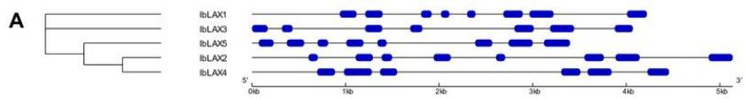

B  
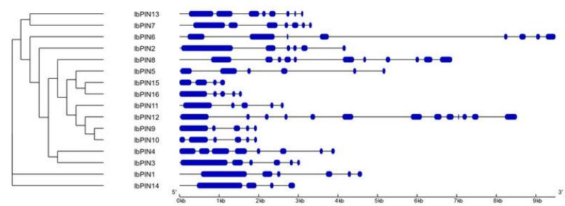  
C

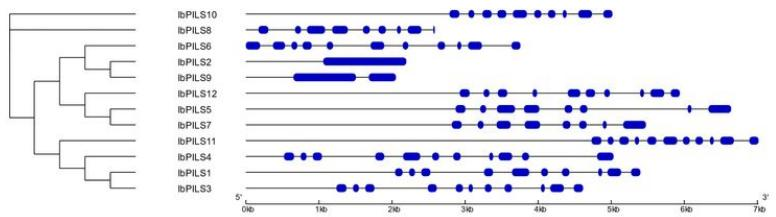  
D

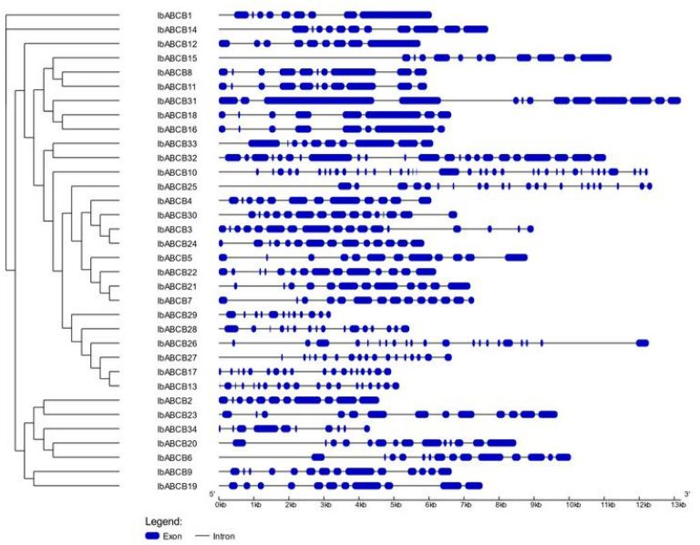  
Figure 1

Intron-exon structure of I. batatas auxin transporter genes. (a) IbLAX (b) IbPIN (c) IbPILS and (d) IbABCB genes. The genes are grouped according to the similarity on a neighbor-joining phylogenetic tree (left)

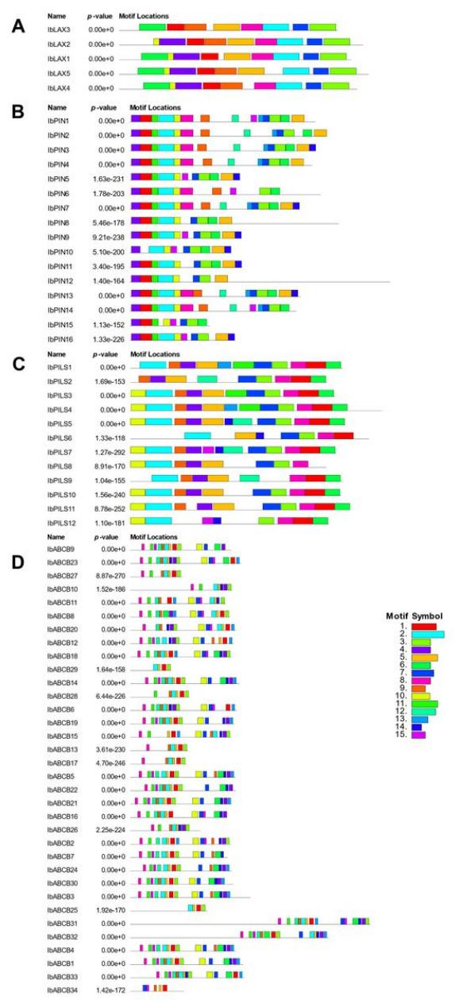  
Figure 2

Motifs detected by MEME. The motifs are shown for (a)IbLAX (b) IbPIN (c) IbPILS and (d)IbABCB protein sequences. The panel on the right shows the motif number associated with each color. Each motif occurs either once or does not occur in the sequence. The motif order is the same for each gene family

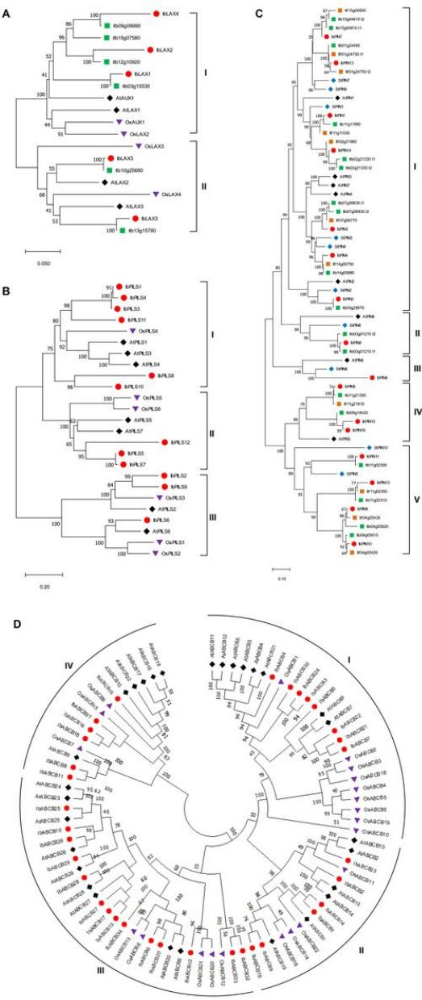  
Figure 3  
Neighbour-joining (NJ) phylogenetic trees showing the relationship between auxin transporter proteins of different species. The trees show the phylogenetic relationships between (a) IbLAX (b) IbPILS (c) IbPIN and (d) IbABCB protein sequences (represented by red circles) with those from A thaliana (black diamonds), S tuberosum (blue diamonds), I triloba (green squares), O sativa spp. Japonica (purple triangles) and/or I trifida (orange squares). The phylogenetic trees were constructed in MEGA 11 with 1000 bootstrap replicates. The percentage of replicate trees in which the associated taxa clustered together in the bootstrap test are shown next to the branches. The NJ trees displayed in (a), (b), and (c) are drawn to scale, with the branch lengths corresponding to evolutionary distances. The evolutionary distances (scale bars below the trees) were computed using the Poisson correction method and are in the units of the number of amino acid substitutions per site

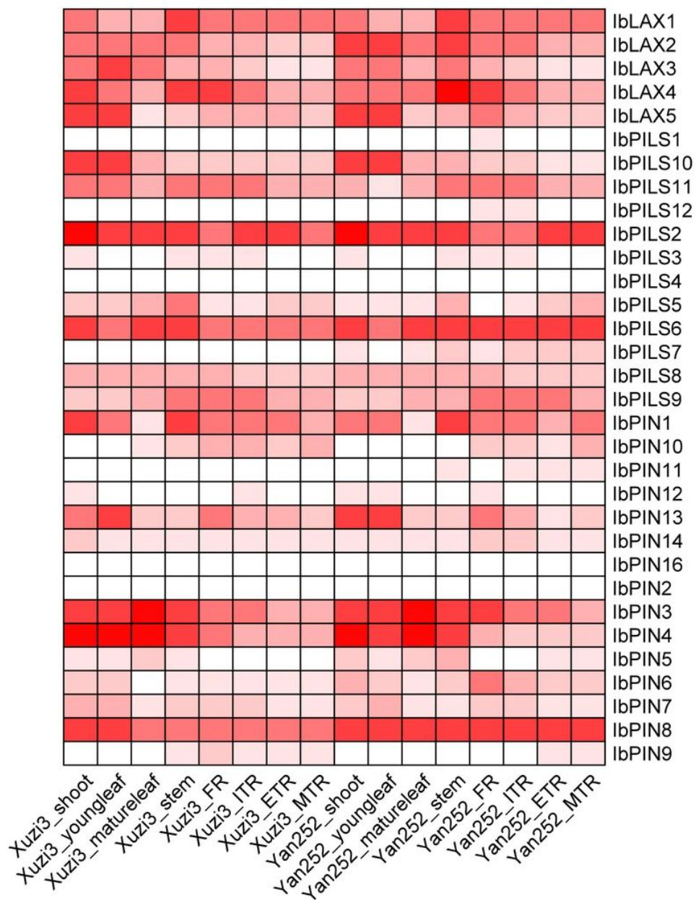  
Figure 4  
Heatmap of LAX, PINand PILSgene expression in various sweet potato plant tissues. The data was obtained from the study by Ding et al. (2017). The heatmap shows the expression values (shown as $\mathsf { l o g } _ { 2 } ( \mathsf { F P K M } + \mathsf { 7 } ) )$ of IbLAX, IbPINand IbPILSgenes in sweet potato cultivars Xuzi3 and Yan252 in the shoot, young leaf, mature leaf, stem, fibrous root (FR), initiating tuberous root (ITR), expanding tuberous root (ETR), and mature tuberous root (MTR) tissues

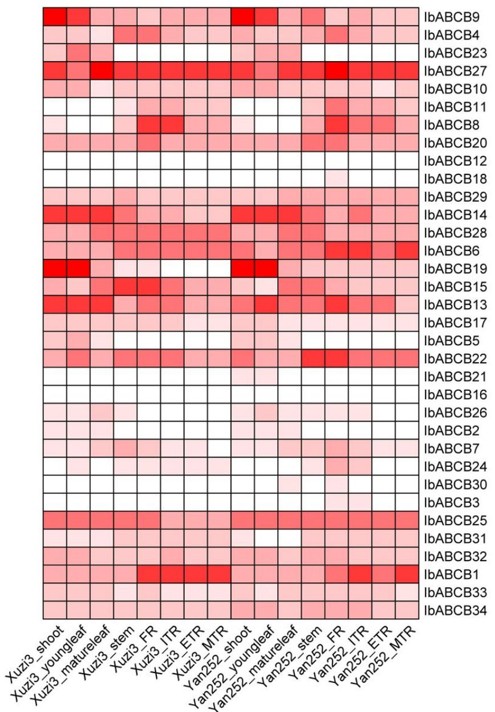  
Figure 5  
Heatmap of ABCBgene expression in various sweet potato plant tissues. The data was obtained from the study by Ding et al. (2017). The heatmap shows the expression values (shown as log (FPKM +1)) of ABCBgenes in sweet potato cultivars Xuzi3 and Yan252 in the shoot, young leaf, mature leaf, stem, fibrous root (FR), initiating tuberous root (ITR), expanding tuberous root (ETR), and mature tuberous root (MTR) tissues

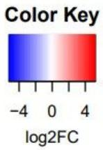

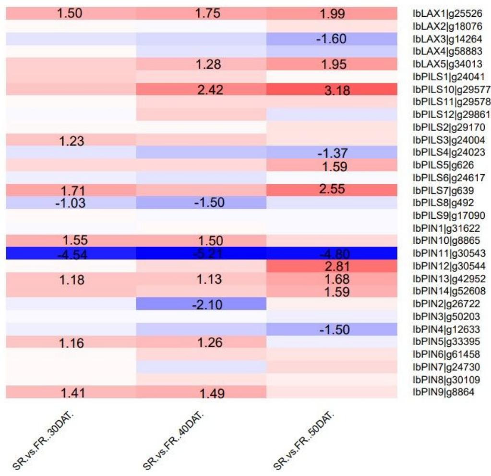  
Figure 6  
Heatmap of the $\mathsf { I o g } _ { 2 } \mathsf { F C }$ of IbLAX, IbPIN, and IbPILSgene expression in SRs vs FRs at 30 DAT, 40 DAT, and 50 DAT respectively. The raw data was obtained from the study by Wu et al. (2018). The $\mathsf { l o g } _ { 2 } \mathsf { F C }$ is considered to be statistically significant at $p < 0 . 0 5$ and $| | \mathsf { o g } _ { 2 } \mathsf { F C } | \geq$ 1. Numbers on the heatmap are the statistically significant $\mathsf { l o g } _ { 2 } \mathsf { F C }$ values. Red represents upregulation while blue represents downregulation

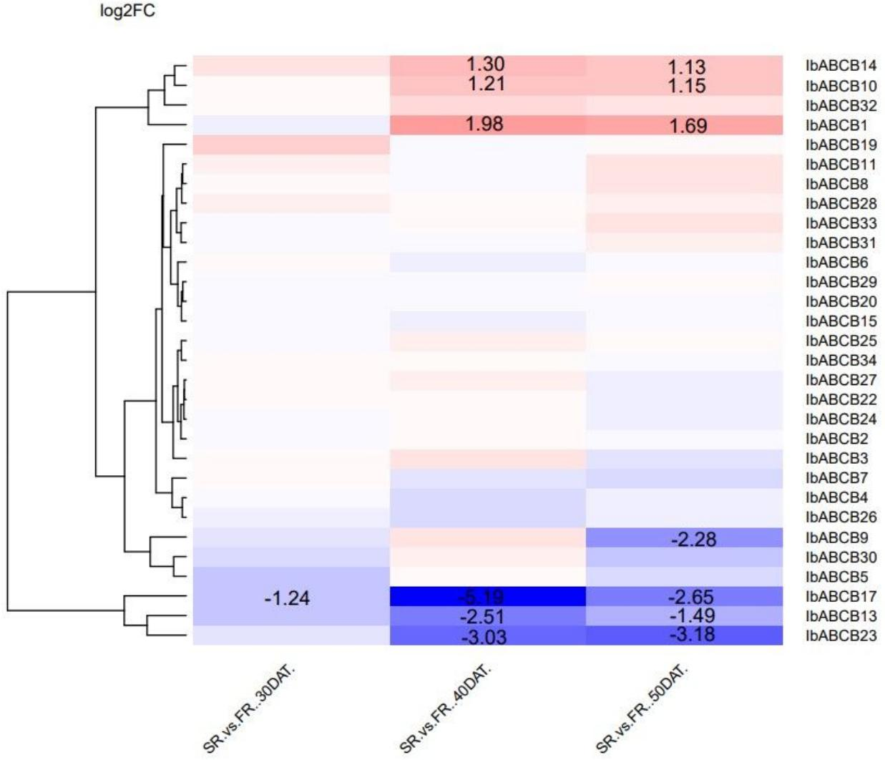  
Figure 7  
Heatmap of the log FC of IbABCBgene expression in SRs vs FRs at 30 DAT, 40 DAT, and 50 DAT respectively. The raw data was obtained from the study by Wu et al. (2018). The $\mathsf { I o g } _ { 2 } \mathsf { F C }$ is considered to be statistically significant at $p < 0 . 0 5$ and $| | \mathsf { o g } _ { 2 } \mathsf { F C } | \geq 1$ Numbers on the heatmap are the statistically significant $\mathsf { I o g } _ { 2 } \mathsf { F C }$ values. Red represents upregulation while blue represents downregulation. The genes are clustered based on the similarity of their expression patterns

<table><tr><td rowspan=1 colspan=1>Gene</td><td rowspan=1 colspan=1>S8S4</td><td rowspan=1 colspan=1>S1S8</td><td rowspan=1 colspan=1>S10S4</td><td rowspan=1 colspan=1>S1258</td><td rowspan=1 colspan=1>S1254</td><td rowspan=1 colspan=1>S12210</td><td rowspan=1 colspan=1>S14S12</td><td rowspan=1 colspan=1>S16S14</td><td rowspan=1 colspan=1>S16S12</td><td rowspan=1 colspan=1>S16510</td><td rowspan=1 colspan=1>S14S10</td><td rowspan=1 colspan=1>S14458</td><td rowspan=1 colspan=1>S14S4</td><td rowspan=1 colspan=1>S1S8</td><td rowspan=1 colspan=1>S165S4</td></tr><tr><td rowspan=1 colspan=1>LAXI</td><td rowspan=1 colspan=1></td><td rowspan=1 colspan=1></td><td rowspan=1 colspan=1></td><td rowspan=1 colspan=1></td><td rowspan=1 colspan=1></td><td rowspan=1 colspan=1></td><td rowspan=1 colspan=1></td><td rowspan=1 colspan=1></td><td rowspan=1 colspan=1></td><td rowspan=1 colspan=1></td><td rowspan=1 colspan=1></td><td rowspan=1 colspan=1></td><td rowspan=1 colspan=1></td><td rowspan=1 colspan=1></td><td rowspan=1 colspan=1></td></tr><tr><td rowspan=1 colspan=1>LAX2</td><td rowspan=1 colspan=1></td><td rowspan=1 colspan=1></td><td rowspan=1 colspan=1></td><td rowspan=1 colspan=1></td><td rowspan=1 colspan=1></td><td rowspan=1 colspan=1></td><td rowspan=1 colspan=1></td><td rowspan=1 colspan=1></td><td rowspan=1 colspan=1></td><td rowspan=1 colspan=1></td><td rowspan=1 colspan=1></td><td rowspan=1 colspan=1></td><td rowspan=1 colspan=1></td><td rowspan=1 colspan=1></td><td rowspan=1 colspan=1></td></tr><tr><td rowspan=1 colspan=1>LAX3</td><td rowspan=1 colspan=1></td><td rowspan=1 colspan=1></td><td rowspan=1 colspan=1></td><td rowspan=1 colspan=1></td><td rowspan=1 colspan=1></td><td rowspan=1 colspan=1></td><td rowspan=1 colspan=1></td><td rowspan=1 colspan=1></td><td rowspan=1 colspan=1></td><td rowspan=1 colspan=1></td><td rowspan=1 colspan=1></td><td rowspan=1 colspan=1></td><td rowspan=1 colspan=1></td><td rowspan=1 colspan=1></td><td rowspan=1 colspan=1></td></tr><tr><td rowspan=1 colspan=1>LAX5</td><td rowspan=1 colspan=1></td><td rowspan=1 colspan=1></td><td rowspan=1 colspan=1></td><td rowspan=1 colspan=1></td><td rowspan=1 colspan=1></td><td rowspan=1 colspan=1></td><td rowspan=1 colspan=1></td><td rowspan=1 colspan=1></td><td rowspan=1 colspan=1></td><td rowspan=1 colspan=1></td><td rowspan=1 colspan=1></td><td rowspan=1 colspan=1></td><td rowspan=1 colspan=1></td><td rowspan=1 colspan=1></td><td rowspan=1 colspan=1></td></tr><tr><td rowspan=1 colspan=1>PIN1</td><td rowspan=1 colspan=1></td><td rowspan=1 colspan=1></td><td rowspan=1 colspan=1></td><td rowspan=1 colspan=1></td><td rowspan=1 colspan=1></td><td rowspan=1 colspan=1></td><td rowspan=1 colspan=1></td><td rowspan=1 colspan=1></td><td rowspan=1 colspan=1></td><td rowspan=1 colspan=1></td><td rowspan=1 colspan=1></td><td rowspan=1 colspan=1></td><td rowspan=1 colspan=1></td><td rowspan=1 colspan=1></td><td rowspan=1 colspan=1></td></tr><tr><td rowspan=1 colspan=1>PIN2</td><td rowspan=1 colspan=1></td><td rowspan=1 colspan=1></td><td rowspan=1 colspan=1></td><td rowspan=1 colspan=1></td><td rowspan=1 colspan=1></td><td rowspan=1 colspan=1></td><td rowspan=1 colspan=1></td><td rowspan=1 colspan=1></td><td rowspan=1 colspan=1></td><td rowspan=1 colspan=1></td><td rowspan=1 colspan=1></td><td rowspan=1 colspan=1></td><td rowspan=1 colspan=1></td><td rowspan=1 colspan=1></td><td rowspan=1 colspan=1></td></tr><tr><td rowspan=1 colspan=1>PIN3</td><td rowspan=1 colspan=1></td><td rowspan=1 colspan=1></td><td rowspan=1 colspan=1></td><td rowspan=1 colspan=1></td><td rowspan=1 colspan=1></td><td rowspan=1 colspan=1></td><td rowspan=1 colspan=1></td><td rowspan=1 colspan=1></td><td rowspan=1 colspan=1></td><td rowspan=1 colspan=1></td><td rowspan=1 colspan=1></td><td rowspan=1 colspan=1></td><td rowspan=1 colspan=1></td><td rowspan=1 colspan=1></td><td rowspan=1 colspan=1></td></tr><tr><td rowspan=1 colspan=1>PIN4</td><td rowspan=1 colspan=1></td><td rowspan=1 colspan=1></td><td rowspan=1 colspan=1></td><td rowspan=1 colspan=1></td><td rowspan=1 colspan=1></td><td rowspan=1 colspan=1></td><td rowspan=1 colspan=1></td><td rowspan=1 colspan=1></td><td rowspan=1 colspan=1></td><td rowspan=1 colspan=1></td><td rowspan=1 colspan=1></td><td rowspan=1 colspan=1></td><td rowspan=1 colspan=1></td><td rowspan=1 colspan=1></td><td rowspan=1 colspan=1></td></tr><tr><td rowspan=1 colspan=1>PIN5</td><td rowspan=1 colspan=1></td><td rowspan=1 colspan=1></td><td rowspan=1 colspan=1></td><td rowspan=1 colspan=1></td><td rowspan=1 colspan=1></td><td rowspan=1 colspan=1></td><td rowspan=1 colspan=1></td><td rowspan=1 colspan=1></td><td rowspan=1 colspan=1></td><td rowspan=1 colspan=1></td><td rowspan=1 colspan=1></td><td rowspan=1 colspan=1></td><td rowspan=1 colspan=1></td><td rowspan=1 colspan=1></td><td rowspan=1 colspan=1></td></tr><tr><td rowspan=1 colspan=1>PIN6</td><td rowspan=1 colspan=1></td><td rowspan=1 colspan=1></td><td rowspan=1 colspan=1></td><td rowspan=1 colspan=1></td><td rowspan=1 colspan=1></td><td rowspan=1 colspan=1></td><td rowspan=1 colspan=1></td><td rowspan=1 colspan=1></td><td rowspan=1 colspan=1></td><td rowspan=1 colspan=1></td><td rowspan=1 colspan=1></td><td rowspan=1 colspan=1></td><td rowspan=1 colspan=1></td><td rowspan=1 colspan=1></td><td rowspan=1 colspan=1></td></tr><tr><td rowspan=1 colspan=1>PIN7</td><td rowspan=1 colspan=1></td><td rowspan=1 colspan=1></td><td rowspan=1 colspan=1></td><td rowspan=1 colspan=1></td><td rowspan=1 colspan=1></td><td rowspan=1 colspan=1></td><td rowspan=1 colspan=1></td><td rowspan=1 colspan=1></td><td rowspan=1 colspan=1></td><td rowspan=1 colspan=1></td><td rowspan=1 colspan=1></td><td rowspan=1 colspan=1></td><td rowspan=1 colspan=1></td><td rowspan=1 colspan=1></td><td rowspan=1 colspan=1></td></tr><tr><td rowspan=1 colspan=1>PIN10</td><td rowspan=1 colspan=1></td><td rowspan=1 colspan=1></td><td rowspan=1 colspan=1></td><td rowspan=1 colspan=1></td><td rowspan=1 colspan=1></td><td rowspan=1 colspan=1></td><td rowspan=1 colspan=1></td><td rowspan=1 colspan=1></td><td rowspan=1 colspan=1></td><td rowspan=1 colspan=1></td><td rowspan=1 colspan=1></td><td rowspan=1 colspan=1></td><td rowspan=1 colspan=1></td><td rowspan=1 colspan=1></td><td rowspan=1 colspan=1></td></tr><tr><td rowspan=1 colspan=1>PIN11</td><td rowspan=1 colspan=1></td><td rowspan=1 colspan=1></td><td rowspan=1 colspan=1></td><td rowspan=1 colspan=1></td><td rowspan=1 colspan=1></td><td rowspan=1 colspan=1></td><td rowspan=1 colspan=1></td><td rowspan=1 colspan=1></td><td rowspan=1 colspan=1></td><td rowspan=1 colspan=1></td><td rowspan=1 colspan=1></td><td rowspan=1 colspan=1></td><td rowspan=1 colspan=1></td><td rowspan=1 colspan=1></td><td rowspan=1 colspan=1></td></tr><tr><td rowspan=1 colspan=1>PIN12</td><td rowspan=1 colspan=1></td><td rowspan=1 colspan=1></td><td rowspan=1 colspan=1></td><td rowspan=1 colspan=1></td><td rowspan=1 colspan=1></td><td rowspan=1 colspan=1></td><td rowspan=1 colspan=1></td><td rowspan=1 colspan=1></td><td rowspan=1 colspan=1></td><td rowspan=1 colspan=1></td><td rowspan=1 colspan=1></td><td rowspan=1 colspan=1></td><td rowspan=1 colspan=1></td><td rowspan=1 colspan=1></td><td rowspan=1 colspan=1></td></tr><tr><td rowspan=1 colspan=1>PIN13</td><td rowspan=1 colspan=1></td><td rowspan=1 colspan=1></td><td rowspan=1 colspan=1></td><td rowspan=1 colspan=1></td><td rowspan=1 colspan=1></td><td rowspan=1 colspan=1></td><td rowspan=1 colspan=1></td><td rowspan=1 colspan=1></td><td rowspan=1 colspan=1></td><td rowspan=1 colspan=1></td><td rowspan=1 colspan=1></td><td rowspan=1 colspan=1></td><td rowspan=1 colspan=1></td><td rowspan=1 colspan=1></td><td rowspan=1 colspan=1></td></tr><tr><td rowspan=1 colspan=1>PILS2</td><td rowspan=1 colspan=1></td><td rowspan=1 colspan=1></td><td rowspan=1 colspan=1></td><td rowspan=1 colspan=1></td><td rowspan=1 colspan=1></td><td rowspan=1 colspan=1></td><td rowspan=1 colspan=1></td><td rowspan=1 colspan=1></td><td rowspan=1 colspan=1></td><td rowspan=1 colspan=1></td><td rowspan=1 colspan=1></td><td rowspan=1 colspan=1></td><td rowspan=1 colspan=1></td><td rowspan=1 colspan=1></td><td rowspan=1 colspan=1></td></tr><tr><td rowspan=1 colspan=1>PILS3</td><td rowspan=1 colspan=1></td><td rowspan=1 colspan=1></td><td rowspan=1 colspan=1></td><td rowspan=1 colspan=1></td><td rowspan=1 colspan=1></td><td rowspan=1 colspan=1></td><td rowspan=1 colspan=1></td><td rowspan=1 colspan=1></td><td rowspan=1 colspan=1></td><td rowspan=1 colspan=1></td><td rowspan=1 colspan=1></td><td rowspan=1 colspan=1></td><td rowspan=1 colspan=1></td><td rowspan=1 colspan=1></td><td rowspan=1 colspan=1></td></tr><tr><td rowspan=1 colspan=1>PILS5</td><td rowspan=1 colspan=1></td><td rowspan=1 colspan=1></td><td rowspan=1 colspan=1></td><td rowspan=1 colspan=1></td><td rowspan=1 colspan=1></td><td rowspan=1 colspan=1></td><td rowspan=1 colspan=1></td><td rowspan=1 colspan=1></td><td rowspan=1 colspan=1></td><td rowspan=1 colspan=1></td><td rowspan=1 colspan=1></td><td rowspan=1 colspan=1></td><td rowspan=1 colspan=1></td><td rowspan=1 colspan=1></td><td rowspan=1 colspan=1></td></tr><tr><td rowspan=1 colspan=1>PILS6</td><td rowspan=1 colspan=1></td><td rowspan=1 colspan=1></td><td rowspan=1 colspan=1></td><td rowspan=1 colspan=1></td><td rowspan=1 colspan=1></td><td rowspan=1 colspan=1></td><td rowspan=1 colspan=1></td><td rowspan=1 colspan=1></td><td rowspan=1 colspan=1></td><td rowspan=1 colspan=1></td><td rowspan=1 colspan=1></td><td rowspan=1 colspan=1></td><td rowspan=1 colspan=1></td><td rowspan=1 colspan=1></td><td rowspan=1 colspan=1></td></tr><tr><td rowspan=1 colspan=1>PILS7</td><td rowspan=1 colspan=1></td><td rowspan=1 colspan=1></td><td rowspan=1 colspan=1></td><td rowspan=1 colspan=1></td><td rowspan=1 colspan=1></td><td rowspan=1 colspan=1></td><td rowspan=1 colspan=1></td><td rowspan=1 colspan=1></td><td rowspan=1 colspan=1></td><td rowspan=1 colspan=1></td><td rowspan=1 colspan=1></td><td rowspan=1 colspan=1></td><td rowspan=1 colspan=1></td><td rowspan=1 colspan=1></td><td rowspan=1 colspan=1></td></tr><tr><td rowspan=1 colspan=1>PILS8</td><td rowspan=1 colspan=1></td><td rowspan=1 colspan=1></td><td rowspan=1 colspan=1></td><td rowspan=1 colspan=1></td><td rowspan=1 colspan=1></td><td rowspan=1 colspan=1></td><td rowspan=1 colspan=1></td><td rowspan=1 colspan=1></td><td rowspan=1 colspan=1></td><td rowspan=1 colspan=1></td><td rowspan=1 colspan=1></td><td rowspan=1 colspan=1></td><td rowspan=1 colspan=1></td><td rowspan=1 colspan=1></td><td rowspan=1 colspan=1></td></tr><tr><td rowspan=1 colspan=1>PILS9</td><td rowspan=1 colspan=1></td><td rowspan=1 colspan=1></td><td rowspan=1 colspan=1></td><td rowspan=1 colspan=1></td><td rowspan=1 colspan=1></td><td rowspan=1 colspan=1></td><td rowspan=1 colspan=1></td><td rowspan=1 colspan=1></td><td rowspan=1 colspan=1></td><td rowspan=1 colspan=1></td><td rowspan=1 colspan=1></td><td rowspan=1 colspan=1></td><td rowspan=1 colspan=1></td><td rowspan=1 colspan=1></td><td rowspan=1 colspan=1></td></tr><tr><td rowspan=1 colspan=1>PILS10</td><td rowspan=1 colspan=1></td><td rowspan=1 colspan=1></td><td rowspan=1 colspan=1></td><td rowspan=1 colspan=1></td><td rowspan=1 colspan=1></td><td rowspan=1 colspan=1></td><td rowspan=1 colspan=1></td><td rowspan=1 colspan=1></td><td rowspan=1 colspan=1></td><td rowspan=1 colspan=1></td><td rowspan=1 colspan=1></td><td rowspan=1 colspan=1></td><td rowspan=1 colspan=1></td><td rowspan=1 colspan=1></td><td rowspan=1 colspan=1></td></tr><tr><td rowspan=1 colspan=1>PILS11</td><td rowspan=1 colspan=1></td><td rowspan=1 colspan=1></td><td rowspan=1 colspan=1></td><td rowspan=1 colspan=1></td><td rowspan=1 colspan=1></td><td rowspan=1 colspan=1></td><td rowspan=1 colspan=1></td><td rowspan=1 colspan=1></td><td rowspan=1 colspan=1></td><td rowspan=1 colspan=1></td><td rowspan=1 colspan=1></td><td rowspan=1 colspan=1></td><td rowspan=1 colspan=1></td><td rowspan=1 colspan=1></td><td rowspan=1 colspan=1></td></tr><tr><td rowspan=1 colspan=1>ABCB1</td><td rowspan=1 colspan=1></td><td rowspan=1 colspan=1></td><td rowspan=1 colspan=1></td><td rowspan=1 colspan=1></td><td rowspan=1 colspan=1></td><td rowspan=1 colspan=1></td><td rowspan=1 colspan=1></td><td rowspan=1 colspan=1></td><td rowspan=1 colspan=1></td><td rowspan=1 colspan=1></td><td rowspan=1 colspan=1></td><td rowspan=1 colspan=1></td><td rowspan=1 colspan=1></td><td rowspan=1 colspan=1></td><td rowspan=1 colspan=1></td></tr><tr><td rowspan=1 colspan=1>ABCB2</td><td rowspan=1 colspan=1></td><td rowspan=1 colspan=1></td><td rowspan=1 colspan=1></td><td rowspan=1 colspan=1></td><td rowspan=1 colspan=1></td><td rowspan=1 colspan=1></td><td rowspan=1 colspan=1></td><td rowspan=1 colspan=1></td><td rowspan=1 colspan=1></td><td rowspan=1 colspan=1></td><td rowspan=1 colspan=1></td><td rowspan=1 colspan=1></td><td rowspan=1 colspan=1></td><td rowspan=1 colspan=1></td><td rowspan=1 colspan=1></td></tr><tr><td rowspan=1 colspan=1>ABCB3</td><td rowspan=1 colspan=1></td><td rowspan=1 colspan=1></td><td rowspan=1 colspan=1></td><td rowspan=1 colspan=1></td><td rowspan=1 colspan=1></td><td rowspan=1 colspan=1></td><td rowspan=1 colspan=1></td><td rowspan=1 colspan=1></td><td rowspan=1 colspan=1></td><td rowspan=1 colspan=1></td><td rowspan=1 colspan=1></td><td rowspan=1 colspan=1></td><td rowspan=1 colspan=1></td><td rowspan=1 colspan=1></td><td rowspan=1 colspan=1></td></tr><tr><td rowspan=1 colspan=1>ABCB4</td><td rowspan=1 colspan=1></td><td rowspan=1 colspan=1></td><td rowspan=1 colspan=1></td><td rowspan=1 colspan=1></td><td rowspan=1 colspan=1></td><td rowspan=1 colspan=1></td><td rowspan=1 colspan=1></td><td rowspan=1 colspan=1></td><td rowspan=1 colspan=1></td><td rowspan=1 colspan=1></td><td rowspan=1 colspan=1></td><td rowspan=1 colspan=1></td><td rowspan=1 colspan=1></td><td rowspan=1 colspan=1></td><td rowspan=1 colspan=1></td></tr><tr><td rowspan=1 colspan=1>ABCB5</td><td rowspan=1 colspan=1></td><td rowspan=1 colspan=1></td><td rowspan=1 colspan=1></td><td rowspan=1 colspan=1></td><td rowspan=1 colspan=1></td><td rowspan=1 colspan=1></td><td rowspan=1 colspan=1></td><td rowspan=1 colspan=1></td><td rowspan=1 colspan=1></td><td rowspan=1 colspan=1></td><td rowspan=1 colspan=1></td><td rowspan=1 colspan=1></td><td rowspan=1 colspan=1></td><td rowspan=1 colspan=1></td><td rowspan=1 colspan=1></td></tr><tr><td rowspan=1 colspan=1>ABCB7</td><td rowspan=1 colspan=1></td><td rowspan=1 colspan=1></td><td rowspan=1 colspan=1></td><td rowspan=1 colspan=1></td><td rowspan=1 colspan=1></td><td rowspan=1 colspan=1></td><td rowspan=1 colspan=1></td><td rowspan=1 colspan=1></td><td rowspan=1 colspan=1></td><td rowspan=1 colspan=1></td><td rowspan=1 colspan=1></td><td rowspan=1 colspan=1></td><td rowspan=1 colspan=1></td><td rowspan=1 colspan=1></td><td rowspan=1 colspan=1></td></tr><tr><td rowspan=1 colspan=1>ABCB9</td><td rowspan=1 colspan=1></td><td rowspan=1 colspan=1></td><td rowspan=1 colspan=1></td><td rowspan=1 colspan=1></td><td rowspan=1 colspan=1></td><td rowspan=1 colspan=1></td><td rowspan=1 colspan=1></td><td rowspan=1 colspan=1></td><td rowspan=1 colspan=1></td><td rowspan=1 colspan=1></td><td rowspan=1 colspan=1></td><td rowspan=1 colspan=1></td><td rowspan=1 colspan=1></td><td rowspan=1 colspan=1></td><td rowspan=1 colspan=1></td></tr><tr><td rowspan=1 colspan=1>ABCB10</td><td rowspan=1 colspan=1></td><td rowspan=1 colspan=1></td><td rowspan=1 colspan=1></td><td rowspan=1 colspan=1></td><td rowspan=1 colspan=1></td><td rowspan=1 colspan=1></td><td rowspan=1 colspan=1></td><td rowspan=1 colspan=1></td><td rowspan=1 colspan=1></td><td rowspan=1 colspan=1></td><td rowspan=1 colspan=1></td><td rowspan=1 colspan=1></td><td rowspan=1 colspan=1></td><td rowspan=1 colspan=1></td><td rowspan=1 colspan=1></td></tr><tr><td rowspan=1 colspan=1>ABCB13</td><td rowspan=1 colspan=1></td><td rowspan=1 colspan=1></td><td rowspan=1 colspan=1></td><td rowspan=1 colspan=1></td><td rowspan=1 colspan=1></td><td rowspan=1 colspan=1></td><td rowspan=1 colspan=1></td><td rowspan=1 colspan=1></td><td rowspan=1 colspan=1></td><td rowspan=1 colspan=1></td><td rowspan=1 colspan=1></td><td rowspan=1 colspan=1></td><td rowspan=1 colspan=1></td><td rowspan=1 colspan=1></td><td rowspan=1 colspan=1></td></tr><tr><td rowspan=1 colspan=1>ABCB14</td><td rowspan=1 colspan=1></td><td rowspan=1 colspan=1></td><td rowspan=1 colspan=1></td><td rowspan=1 colspan=1></td><td rowspan=1 colspan=1></td><td rowspan=1 colspan=1></td><td rowspan=1 colspan=1></td><td rowspan=1 colspan=1></td><td rowspan=1 colspan=1></td><td rowspan=1 colspan=1></td><td rowspan=1 colspan=1></td><td rowspan=1 colspan=1></td><td rowspan=1 colspan=1></td><td rowspan=1 colspan=1></td><td rowspan=1 colspan=1></td></tr><tr><td rowspan=1 colspan=1>ABCB15</td><td rowspan=1 colspan=1></td><td rowspan=1 colspan=1></td><td rowspan=1 colspan=1></td><td rowspan=1 colspan=1></td><td rowspan=1 colspan=1></td><td rowspan=1 colspan=1></td><td rowspan=1 colspan=1></td><td rowspan=1 colspan=1></td><td rowspan=1 colspan=1></td><td rowspan=1 colspan=1></td><td rowspan=1 colspan=1></td><td rowspan=1 colspan=1></td><td rowspan=1 colspan=1></td><td rowspan=1 colspan=1></td><td rowspan=1 colspan=1></td></tr><tr><td rowspan=1 colspan=1>ABCB18</td><td rowspan=1 colspan=1></td><td rowspan=1 colspan=1></td><td rowspan=1 colspan=1></td><td rowspan=1 colspan=1></td><td rowspan=1 colspan=1></td><td rowspan=1 colspan=1></td><td rowspan=1 colspan=1></td><td rowspan=1 colspan=1></td><td rowspan=1 colspan=1></td><td rowspan=1 colspan=1></td><td rowspan=1 colspan=1></td><td rowspan=1 colspan=1></td><td rowspan=1 colspan=1></td><td rowspan=1 colspan=1></td><td rowspan=1 colspan=1></td></tr><tr><td rowspan=1 colspan=1>ABCB20</td><td rowspan=1 colspan=1></td><td rowspan=1 colspan=1></td><td rowspan=1 colspan=1></td><td rowspan=1 colspan=1></td><td rowspan=1 colspan=1></td><td rowspan=1 colspan=1></td><td rowspan=1 colspan=1></td><td rowspan=1 colspan=1></td><td rowspan=1 colspan=1></td><td rowspan=1 colspan=1></td><td rowspan=1 colspan=1></td><td rowspan=1 colspan=1></td><td rowspan=1 colspan=1></td><td rowspan=1 colspan=1></td><td rowspan=1 colspan=1></td></tr><tr><td rowspan=1 colspan=1>ABCB21</td><td rowspan=1 colspan=1></td><td rowspan=1 colspan=1></td><td rowspan=1 colspan=1></td><td rowspan=1 colspan=1></td><td rowspan=1 colspan=1></td><td rowspan=1 colspan=1></td><td rowspan=1 colspan=1></td><td rowspan=1 colspan=1></td><td rowspan=1 colspan=1></td><td rowspan=1 colspan=1></td><td rowspan=1 colspan=1></td><td rowspan=1 colspan=1></td><td rowspan=1 colspan=1></td><td rowspan=1 colspan=1></td><td rowspan=1 colspan=1></td></tr><tr><td rowspan=1 colspan=1>ABCB24</td><td rowspan=1 colspan=1></td><td rowspan=1 colspan=1></td><td rowspan=1 colspan=1></td><td rowspan=1 colspan=1></td><td rowspan=1 colspan=1></td><td rowspan=1 colspan=1></td><td rowspan=1 colspan=1></td><td rowspan=1 colspan=1></td><td rowspan=1 colspan=1></td><td rowspan=1 colspan=1></td><td rowspan=1 colspan=1></td><td rowspan=1 colspan=1></td><td rowspan=1 colspan=1></td><td rowspan=1 colspan=1></td><td rowspan=1 colspan=1></td></tr><tr><td rowspan=1 colspan=1>ABCB28</td><td rowspan=1 colspan=1></td><td rowspan=1 colspan=1></td><td rowspan=1 colspan=1></td><td rowspan=1 colspan=1></td><td rowspan=1 colspan=1></td><td rowspan=1 colspan=1></td><td rowspan=1 colspan=1></td><td rowspan=1 colspan=1></td><td rowspan=1 colspan=1></td><td rowspan=1 colspan=1></td><td rowspan=1 colspan=1></td><td rowspan=1 colspan=1></td><td rowspan=1 colspan=1></td><td rowspan=1 colspan=1></td><td rowspan=1 colspan=1></td></tr><tr><td rowspan=1 colspan=1>ABCB30</td><td rowspan=1 colspan=1></td><td rowspan=1 colspan=1></td><td rowspan=1 colspan=1></td><td rowspan=1 colspan=1></td><td rowspan=1 colspan=1></td><td rowspan=1 colspan=1></td><td rowspan=1 colspan=1></td><td rowspan=1 colspan=1></td><td rowspan=1 colspan=1></td><td rowspan=1 colspan=1></td><td rowspan=1 colspan=1></td><td rowspan=1 colspan=1></td><td rowspan=1 colspan=1></td><td rowspan=1 colspan=1></td><td rowspan=1 colspan=1></td></tr><tr><td rowspan=1 colspan=1>ABCB31</td><td rowspan=1 colspan=1></td><td rowspan=1 colspan=1></td><td rowspan=1 colspan=1></td><td rowspan=1 colspan=1></td><td rowspan=1 colspan=1></td><td rowspan=1 colspan=1></td><td rowspan=1 colspan=1></td><td rowspan=1 colspan=1></td><td rowspan=1 colspan=1></td><td rowspan=1 colspan=1></td><td rowspan=1 colspan=1></td><td rowspan=1 colspan=1></td><td rowspan=1 colspan=1></td><td rowspan=1 colspan=1></td><td rowspan=1 colspan=1></td></tr><tr><td rowspan=1 colspan=1>ABCB32</td><td rowspan=1 colspan=1></td><td rowspan=1 colspan=1></td><td rowspan=1 colspan=1></td><td rowspan=1 colspan=1></td><td rowspan=1 colspan=1></td><td rowspan=1 colspan=1></td><td rowspan=1 colspan=1></td><td rowspan=1 colspan=1></td><td rowspan=1 colspan=1></td><td rowspan=1 colspan=1></td><td rowspan=1 colspan=1></td><td rowspan=1 colspan=1></td><td rowspan=1 colspan=1></td><td rowspan=1 colspan=1></td><td rowspan=1 colspan=1></td></tr><tr><td rowspan=1 colspan=1>ABCB33</td><td rowspan=1 colspan=1></td><td rowspan=1 colspan=1></td><td rowspan=1 colspan=1></td><td rowspan=1 colspan=1></td><td rowspan=1 colspan=1></td><td rowspan=1 colspan=1></td><td rowspan=1 colspan=1></td><td rowspan=1 colspan=1></td><td rowspan=1 colspan=1></td><td rowspan=1 colspan=1></td><td rowspan=1 colspan=1></td><td rowspan=1 colspan=1></td><td rowspan=1 colspan=1></td><td rowspan=1 colspan=1></td><td rowspan=1 colspan=1></td></tr></table>

Figure 8

Expression of auxin transporter genes in initiating I batatas cv. Taizhong6 initiating storage roots. Raw data was obtained from NCB SRA accession number PRJNA647694 (He et al., 2021), which contained RNA-seq reads from I batatas cv. Taizhong6 roots at stages S4 and S8 (fibrous roots), S10 and S12 (pencil roots), and S14 and S16 (initiating tuberous roots). A gene was significantly differentially expressed if $| | \mathsf { o g } _ { 2 } \mathsf { F C } | \geq 2$ and adjusted p-value < 0.05. Pink squares represent upregulation, green squares represent downregulation, and white squares represent no differential expression. Only differentially expressed transporters are listed

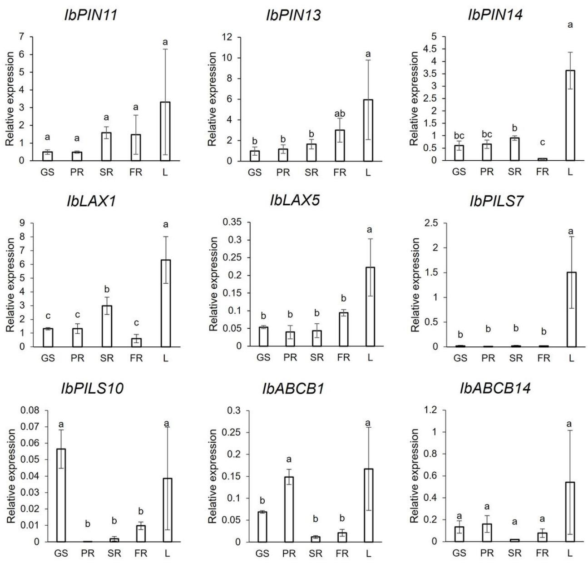  
Figure 9

Expression of auxin transporter genes in sweet potato using qRT-PCR. The expression of each gene was normalized to the housekeeping gene. Error bars represent the standard deviation and bars with different letters above them have statistically significant differences (p < 0.05) calculated using One-Way ANOVA and Duncan’s multiple ranges test

## Supplementary Files

This is a list of supplementary files associated with this preprint. Click to download.

SupplementaryTable1.xlsx

SupplementaryTable2.docx

SupplementaryTable3.xlsx